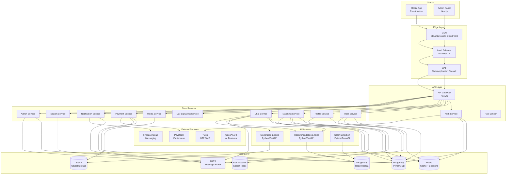
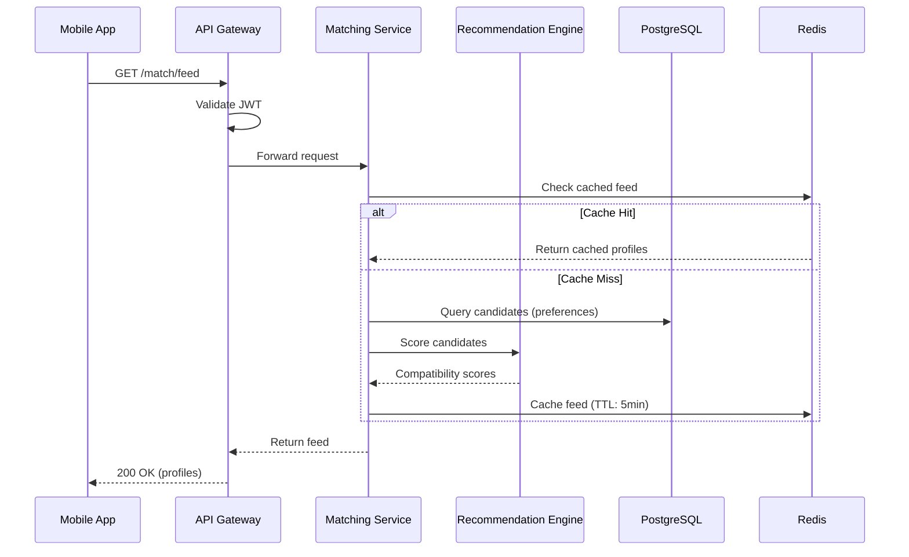
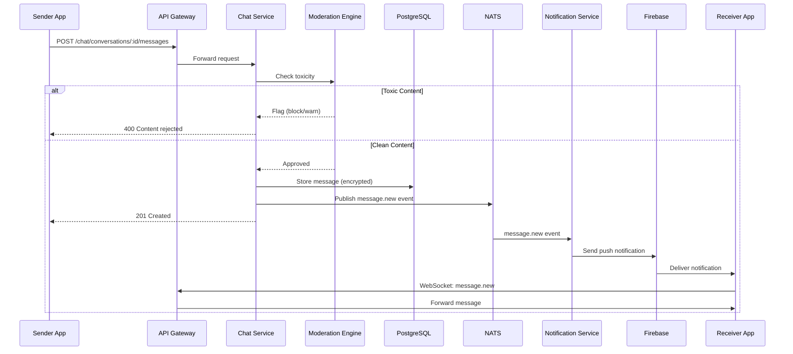
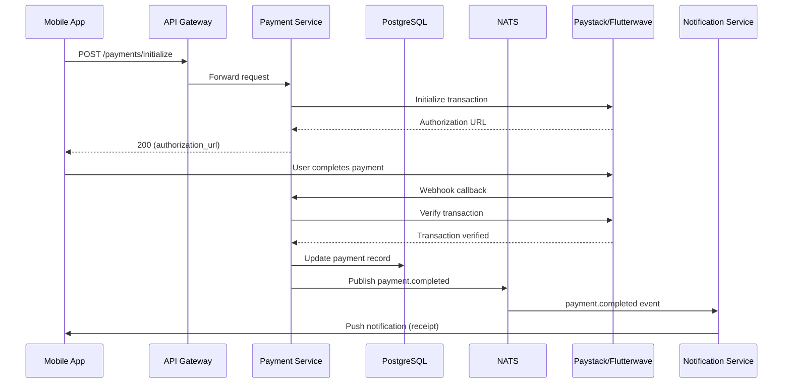
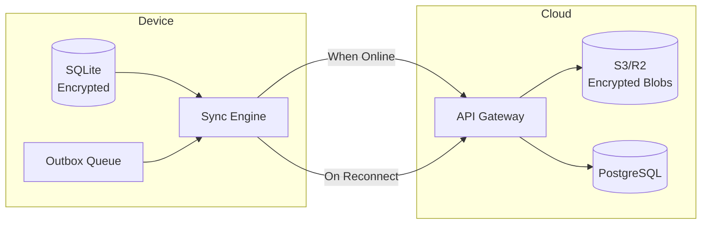
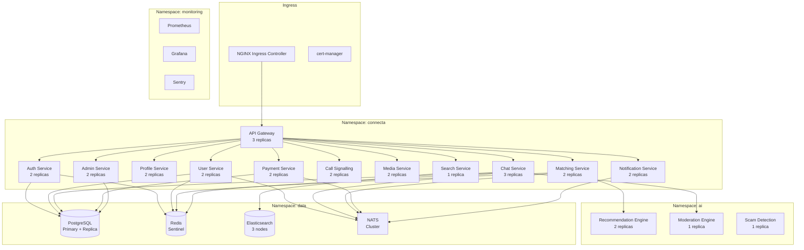

# System Architecture

## Connecta — Technical Architecture Document

**Version:** 1.0.0
**Date:** July 2026

---

## 1. Architecture Overview

Connecta uses a **microservices architecture** with an **API Gateway** pattern. The system is designed for horizontal scalability, fault isolation, and independent deployment of services.

### 1.1 Architecture Style

- **Microservices** — Each domain has its own service, database, and deployment unit
- **Event-Driven** — Asynchronous communication via message broker (NATS/RabbitMQ)
- **CQRS (Command Query Responsibility Segregation)** — Separate read and write models for high-throughput services
- **Offline-First** — Mobile client operates independently, syncing when connected
- **API Gateway** — Single entry point for all client requests

### 1.2 High-Level Architecture Diagram



---

## 2. Service Architecture

### 2.1 API Gateway

The API Gateway is the single entry point for all client requests. It handles:

- **Routing** — Routes requests to appropriate microservices
- **Authentication** — Validates JWT tokens, attaches user context
- **Rate Limiting** — Per-user, per-IP, per-endpoint rate limits
- **Request Validation** — Schema validation, content-type checks
- **Response Transformation** — Aggregates responses from multiple services
- **Load Balancing** — Distributes traffic across service instances
- **Circuit Breaking** — Prevents cascade failures
- **Logging & Metrics** — Structured logs, Prometheus metrics

```
Client Request → API Gateway → [Auth Check] → [Rate Limit] → [Route] → Service → Response
```

### 2.2 Service Communication

| Pattern | Use Case | Technology |
|---|---|---|
| Synchronous (HTTP) | Real-time queries, CRUD operations | NestJS HTTP clients |
| Asynchronous (Events) | Cross-service events, notifications | NATS JetStream |
| WebSocket | Real-time chat, typing indicators | Socket.IO |
| WebRTC | Voice/video calls | Peer-to-peer + SFU |

### 2.3 Event Bus (NATS)

All inter-service communication is event-driven:

```typescript
// Example events
Event: user.registered
Event: user.profile.updated
Event: match.created
Event: message.sent
Event: payment.completed
Event: report.submitted
Event: subscription.activated
```

Each service publishes and subscribes to relevant events. No service directly calls another service's internal methods.

---

## 3. Service Specifications

### 3.1 Auth Service

**Responsibility:** User authentication, authorization, token management, OTP verification.

```
Endpoints:
  POST /auth/register
  POST /auth/login
  POST /auth/otp/send
  POST /auth/otp/verify
  POST /auth/refresh
  POST /auth/logout
  POST /auth/forgot-password
  POST /auth/reset-password
  POST /auth/biometric/register
  POST /auth/biometric/verify
  GET  /auth/devices
  DELETE /auth/devices/:id
```

**Database:** PostgreSQL (auth schema)
**Cache:** Redis (sessions, OTP, rate limits)

### 3.2 User Service

**Responsibility:** User CRUD, preferences, account management, user state.

```
Endpoints:
  GET    /users/me
  PUT    /users/me
  DELETE /users/me
  GET    /users/:id (public profile)
  PUT    /users/preferences
  POST   /users/block
  DELETE /users/block/:userId
  POST   /users/pause
  POST   /users/resume
```

**Database:** PostgreSQL (users schema)
**Cache:** Redis (user profiles, online status)

### 3.3 Profile Service

**Responsibility:** Profile photos, bio, verification, profile completeness scoring.

```
Endpoints:
  GET    /profiles/:userId
  PUT    /profiles
  POST   /profiles/photos
  DELETE /profiles/photos/:id
  PUT    /profiles/photos/reorder
  POST   /profiles/verify
  GET    /profiles/verification-status
```

**Database:** PostgreSQL (profiles schema)
**Storage:** S3 (photos)

### 3.4 Matching Service

**Responsibility:** Discovery feed, swipe actions, like/pass/super-like, match creation, compatibility scoring.

```
Endpoints:
  GET    /match/feed (paginated discovery)
  POST   /match/like
  POST   /match/pass
  POST   /match/super-like
  DELETE /match/undo
  GET    /match/matches (list of matches)
  GET    /match/liked-you (premium)
  GET    /match/compatibility/:userId
  PUT    /match/preferences
```

**Database:** PostgreSQL (matches schema)
**Cache:** Redis (feed, like counts, compatibility scores)
**AI:** Calls Recommendation Engine for compatibility scoring

### 3.5 Chat Service

**Responsibility:** Real-time messaging, message history, read receipts, typing indicators, voice notes.

```
Endpoints:
  GET    /chat/conversations
  GET    /chat/conversations/:id/messages
  POST   /chat/conversations/:id/messages
  DELETE /chat/messages/:id
  POST   /chat/messages/:id/react
  POST   /chat/messages/:id/read
  POST   /chat/typing/:conversationId
  GET    /chat/search
```

**WebSocket Events:**
```
message.new
message.read
typing.start
typing.stop
message.reaction
message.deleted
```

**Database:** PostgreSQL (messages schema)
**Cache:** Redis (online status, typing state)
**AI:** Calls Moderation Engine for toxicity detection

### 3.6 Call Signalling Service

**Responsibility:** WebRTC signalling, call management, push wake-up.

```
Endpoints:
  POST   /calls/start
  POST   /calls/answer
  POST   /calls/reject
  POST   /calls/end
  GET    /calls/history
  POST   /calls/ice-candidate
```

**WebSocket Events:**
```
call.incoming
call.answered
call.rejected
call.ended
call.ice-candidate
call.reconnecting
```

### 3.7 Media Service

**Responsibility:** File upload, image processing, compression, CDN integration.

```
Endpoints:
  POST   /media/upload
  POST   /media/presigned-url
  GET    /media/:id
  DELETE /media/:id
```

**Storage:** S3/R2 with CloudFront/Cloudflare CDN
**Processing:** Sharp (images), FFmpeg (video/audio)

### 3.8 Payment Service

**Responsibility:** Subscription management, payment processing, refunds, receipts.

```
Endpoints:
  GET    /subscriptions/plans
  POST   /subscriptions/subscribe
  POST   /subscriptions/cancel
  POST   /subscriptions/upgrade
  POST   /subscriptions/downgrade
  POST   /payments/initialize
  POST   /payments/verify
  GET    /payments/history
  POST   /payments/refund
  GET    /receipts/:id
```

**Database:** PostgreSQL (payments schema, encrypted columns)
**External:** Paystack/Flutterwave API

### 3.9 Notification Service

**Responsibility:** Push notifications, email notifications, in-app notifications, notification preferences.

```
Endpoints:
  GET    /notifications
  PUT    /notifications/preferences
  POST   /notifications/mark-read
  POST   /notifications/broadcast (admin)
  PUT    /notifications/quiet-hours
```

**External:** Firebase Cloud Messaging (FCM), SendGrid (email)

### 3.10 Search Service

**Responsibility:** User search, profile search, autocomplete.

```
Endpoints:
  GET /search/users?q=...
  GET /search/autocomplete?q=...
```

**Database:** Elasticsearch / Meilisearch

### 3.11 Admin Service

**Responsibility:** Admin authentication, user management, report handling, analytics, content moderation, system settings.

```
Endpoints:
  POST   /admin/login
  POST   /admin/2fa/verify
  GET    /admin/dashboard
  GET    /admin/users
  GET    /admin/users/:id
  PUT    /admin/users/:id/status
  GET    /admin/reports
  PUT    /admin/reports/:id/action
  GET    /admin/analytics/overview
  GET    /admin/analytics/users
  GET    /admin/analytics/revenue
  GET    /admin/audit-log
  PUT    /admin/settings
  POST   /admin/notifications/broadcast
```

**Database:** PostgreSQL (admin schema)
**Cache:** Redis (dashboard metrics)

---

## 4. Data Flow Diagrams

### 4.1 Match Discovery Flow



### 4.2 Message Send Flow



### 4.3 Payment Flow



---

## 5. Offline-First Architecture

### 5.1 Sync Strategy



**Rules:**
- All writes go to local SQLite first (optimistic update)
- Outbox queue stores pending sync operations
- Sync engine processes queue when connectivity is available
- Conflict resolution: Last-write-wins with vector clocks
- Media files: Upload when on WiFi, queue on cellular

### 5.2 Data Conflict Resolution

| Data Type | Resolution Strategy |
|---|---|
| Messages | Server-authoritative (timestamp) |
| Profile updates | Last-write-wins |
| Likes/Swipes | Server-authoritative |
| Settings | User-choice merge |

---

## 6. Security Architecture

### 6.1 Authentication Flow

```mermaid
sequenceDiagram
    participant C as Client
    participant GW as API Gateway
    participant AS as Auth Service
    participant DB as PostgreSQL
    participant Cache as Redis

    C->>GW: POST /auth/login
    GW->>AS: Forward request
    AS->>DB: Verify credentials
    AS->>Cache: Store session
    AS-->>GW: JWT (access + refresh tokens)
    GW-->>C: 200 OK (tokens)

    Note over C,GW: Subsequent requests
    C->>GW: GET /api/resource
    GW->>GW: Validate JWT
    GW->>Cache: Check session validity
    GW->>Forward to service
```

### 6.2 Token Strategy

| Token | Lifetime | Storage | Use |
|---|---|---|---|
| Access Token | 15 minutes | Memory (not persisted) | API authentication |
| Refresh Token | 7 days | Secure storage (Keychain/Keystore) | Token renewal |
| OTP | 5 minutes | Server-side (Redis) | Phone verification |
| Session | 8 hours | Redis | Admin panel sessions |

### 6.3 Encryption Layers

| Layer | Technology | Scope |
|---|---|---|
| In Transit | TLS 1.3 | All network communication |
| At Rest | AES-256-GCM | Database, file storage |
| End-to-End | Signal Protocol | Messages, voice notes |
| Application | Field-level encryption | PII (phone, email) |

---

## 7. Deployment Architecture

### 7.1 Kubernetes Cluster



### 7.2 Environment Strategy

| Environment | Purpose | Infrastructure |
|---|---|---|
| Development | Local development | Docker Compose |
| Staging | Pre-production testing | Single-node K8s |
| Production | Live platform | Multi-node K8s cluster |

---

## 8. Monitoring & Observability

### 8.1 Metrics (Prometheus)

| Metric | Type | Description |
|---|---|---|
| http_requests_total | Counter | Total HTTP requests |
| http_request_duration_seconds | Histogram | Request latency |
| active_websocket_connections | Gauge | Current WebSocket connections |
| messages_sent_total | Counter | Total messages sent |
| matches_created_total | Counter | Total matches created |
| payments_total | Counter | Total successful payments |
| error_rate | Gauge | Error rate percentage |

### 8.2 Logging (Structured JSON)

```json
{
  "timestamp": "2026-07-19T10:30:00Z",
  "level": "info",
  "service": "chat-service",
  "traceId": "abc123",
  "userId": "user_456",
  "action": "message.sent",
  "conversationId": "conv_789",
  "duration": 45,
  "status": 201
}
```

### 8.3 Alerting Rules

| Alert | Condition | Severity |
|---|---|---|
| High Error Rate | > 5% errors for 5 minutes | Critical |
| High Latency | p95 > 500ms for 5 minutes | Warning |
| Low Memory | < 20% free for 10 minutes | Warning |
| Database Connection Pool | > 80% utilized | Critical |
| Payment Failures | > 10% failure rate | Critical |

---

*This document is part of the Connecta Software Design Document (SDD) package.*
