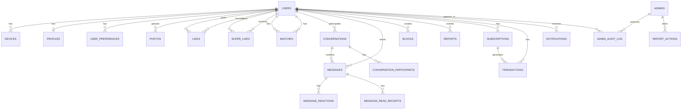

# Database Design

## OJChat — Database Schema & Design

**Version:** 1.0.0
**Date:** July 2026

---

## 1. Database Overview

| Component | Technology | Purpose |
|---|---|---|
| Primary Database | PostgreSQL 15+ | All structured data |
| Cache Layer | Redis 7+ | Sessions, hot data, rate limits |
| Search Engine | Elasticsearch 8+ / Meilisearch | Full-text search, autocomplete |
| Offline Storage | SQLite (SQLCipher) | Mobile device local database |
| Object Storage | AWS S3 / Cloudflare R2 | Photos, media, encrypted message blobs |

### 1.1 Schema Strategy

PostgreSQL uses a single **public** schema for all tables:

```
ojchat_db
└── public → All 48 entities (users, profiles, likes, matches, messages, etc.)
```

---

## 2. Entity Relationship Diagram



---

## 3. Complete Database Schema

All 48 entities are in the `public` schema. Below is the complete entity listing:

### 3.1 Entity Listing

| # | Entity | Table Name | Description |
|---|---|---|---|
| 1 | User | users | Core user accounts, auth credentials, email, phone |
| 2 | Session | sessions | User login sessions, device tracking, refresh tokens |
| 3 | OtpCode | otp_codes | OTP verification codes for phone/email |
| 4 | BiometricCredential | biometric_credentials | Biometric auth credentials (Face ID, fingerprint) |
| 5 | PreKeyBundle | pre_key_bundles | Signal Protocol pre-key bundles for E2E encryption |
| 6 | Profile | profiles | User profiles (name, bio, location, demographics) |
| 7 | ProfilePrompt | profile_prompts | User prompt answers for profile display |
| 8 | ProfileInterest | profile_interests | Many-to-many: profiles ↔ interests |
| 9 | ProfileView | profile_views | Profile view tracking |
| 10 | Interest | interests | Interest tags (hobbies, lifestyle, etc.) |
| 11 | UserPreference | user_preferences | Discovery preferences (age, distance, filters) |
| 12 | Like | likes | Swipe-right actions |
| 13 | Pass | passes | Swipe-left actions |
| 14 | SuperLike | super_likes | Super-like actions (premium feature) |
| 15 | Match | matches | Mutual likes / match records |
| 16 | DailyLike | daily_likes | Daily like count tracking for rate limiting |
| 17 | DailyStreak | daily_streaks | Login streak tracking |
| 18 | Boost | boosts | Profile boost records |
| 19 | EloScore | elo_scores | ELO rating scores for matching algorithm |
| 20 | UserBehavior | user_behaviors | User behavior tracking for algorithm |
| 21 | Block | blocks | User block records |
| 22 | Report | reports | User reports (fake profile, harassment, etc.) |
| 23 | Appeal | appeals | Ban/suspension appeal records |
| 24 | Conversation | conversations | Chat conversation metadata |
| 25 | ConversationParticipant | conversation_participants | Conversation membership |
| 26 | ConversationSignal | conversation_signals | WebRTC signaling for calls |
| 27 | Message | messages | Chat messages (text, image, voice, etc.) |
| 28 | MessageReaction | message_reactions | Emoji reactions on messages |
| 29 | ReadReceipt | read_receipts | Message read receipts |
| 30 | Media | media | Uploaded media records (images, videos) |
| 31 | Photo | photos | User photos (profile images) |
| 32 | PhotoLike | photo_likes | Photo-specific like actions |
| 33 | PhotoAnalytic | photo_analytics | Photo view analytics |
| 34 | CallSession | call_sessions | Voice/video call session records |
| 35 | Subscription | subscriptions | User subscription records |
| 36 | Plan | plans | Subscription plan definitions |
| 37 | Transaction | transactions | Payment transaction records |
| 38 | Notification | notifications | In-app notification records |
| 39 | NotificationPreference | notification_preferences | Per-user notification settings |
| 40 | NotificationDelivery | notification_deliveries | Push notification delivery tracking |
| 41 | DeviceToken | device_tokens | FCM/APNS device tokens for push |
| 42 | Moment | moments | User moments/stories feature |
| 43 | MomentView | moment_views | Moment view tracking |
| 44 | VerificationRequest | verification_requests | Photo ID verification requests |
| 45 | SystemSetting | system_settings | Admin system settings (key-value) |
| 46 | AuditLog | audit_logs | Admin audit trail |
| 47 | AdminUser | admin_users | Admin panel user accounts |
| 48 | AdminSession | admin_sessions | Admin panel sessions |

### 3.2 Schema Overview

```sql
-- All tables in the public schema
-- No CREATE SCHEMA statements needed
-- Connect to: ojchat_db → public schema

-- Core user tables
CREATE TABLE users (...);
CREATE TABLE sessions (...);
CREATE TABLE otp_codes (...);
CREATE TABLE biometric_credentials (...);
CREATE TABLE pre_key_bundles (...);

-- Profile & discovery
CREATE TABLE profiles (...);
CREATE TABLE profile_prompts (...);
CREATE TABLE interests (...);
CREATE TABLE profile_interests (...);
CREATE TABLE user_preferences (...);
CREATE TABLE profile_views (...);

-- Matching
CREATE TABLE likes (...);
CREATE TABLE passes (...);
CREATE TABLE super_likes (...);
CREATE TABLE matches (...);
CREATE TABLE daily_likes (...);
CREATE TABLE daily_streaks (...);
CREATE TABLE boosts (...);
CREATE TABLE elo_scores (...);
CREATE TABLE user_behaviors (...);

-- User safety
CREATE TABLE blocks (...);
CREATE TABLE reports (...);
CREATE TABLE appeals (...);

-- Messaging
CREATE TABLE conversations (...);
CREATE TABLE conversation_participants (...);
CREATE TABLE conversation_signals (...);
CREATE TABLE messages (...);
CREATE TABLE message_reactions (...);
CREATE TABLE read_receipts (...);

-- Media
CREATE TABLE media (...);
CREATE TABLE photos (...);
CREATE TABLE photo_likes (...);
CREATE TABLE photo_analytics (...);

-- Calls
CREATE TABLE call_sessions (...);

-- Payments
CREATE TABLE subscriptions (...);
CREATE TABLE plans (...);
CREATE TABLE transactions (...);

-- Notifications
CREATE TABLE notifications (...);
CREATE TABLE notification_preferences (...);
CREATE TABLE notification_deliveries (...);
CREATE TABLE device_tokens (...);

-- Moments
CREATE TABLE moments (...);
CREATE TABLE moment_views (...);

-- Verification
CREATE TABLE verification_requests (...);

-- Admin
CREATE TABLE system_settings (...);
CREATE TABLE audit_logs (...);
CREATE TABLE admin_users (...);
CREATE TABLE admin_sessions (...);
```

---

## 4. Indexes & Performance

### 4.1 Critical Query Patterns

| Query Pattern | Table | Index |
|---|---|---|
| Feed generation | likes | (user_id, created_at) |
| Conversation list | conversation_participants | (user_id, unread_count) |
| Message history | messages | (conversation_id, created_at DESC) |
| User search | profiles | GIN on tsvector of name, bio |
| Nearby users | profiles | GiST on (latitude, longitude) |
| Report queue | reports | (status, ai_score DESC) |
| Daily like count | daily_likes | (user_id, date) |

### 4.2 Partitioning Strategy

- **messages** — Consider partitioning by conversation_id at 10M+ rows
- **transactions** — Monthly range partitioning at 1M+ rows

### 4.3 Archival Strategy

| Table | Hot Data | Warm Data | Cold/Archive |
|---|---|---|---|
| messages | 30 days | 1 year | S3 glacier |
| transactions | 1 year | 7 years | Encrypted archive |
| notifications | 30 days | 90 days | Delete |

---

## 5. Redis Schema

```yaml
# Session management
session:{userId}:{deviceId}     → JWT payload (TTL: 8h)

# Rate limiting
ratelimit:{endpoint}:{userId}   → count (TTL: 1min/hour)

# OTP
otp:{phone}:{purpose}           → code (TTL: 5min)

# User online status
online:{userId}                 → last_seen timestamp (TTL: 5min)

# Typing indicator
typing:{conversationId}:{userId} → 1 (TTL: 5s)

# Daily likes
likes:daily:{userId}:{date}     → count (TTL: 24h)

# Match feed cache
feed:{userId}                   → [profileIds] (TTL: 5min)

# Compatibility scores
compat:{userId}:{candidateId}   → score (TTL: 1h)

# Dashboard metrics (admin)
dashboard:metrics               → JSON (TTL: 60s)

# Feature flags
featureflags:{flagName}         → enabled (TTL: 300s)
```

---

## 6. SQLite Schema (Mobile Offline)

```sql
-- Mobile local database (SQLCipher encrypted)

CREATE TABLE local_messages (
    id              TEXT PRIMARY KEY,
    conversation_id TEXT NOT NULL,
    sender_id       TEXT NOT NULL,
    content         TEXT,
    content_type    TEXT NOT NULL,
    media_url       TEXT,
    is_deleted      INTEGER DEFAULT 0,
    is_sent         INTEGER DEFAULT 0, -- 0=pending, 1=sent, 2=failed
    created_at      INTEGER NOT NULL, -- unix timestamp
    sent_at         INTEGER
);

CREATE TABLE local_conversations (
    id              TEXT PRIMARY KEY,
    match_id        TEXT,
    other_user_id   TEXT NOT NULL,
    last_message    TEXT,
    last_message_at INTEGER,
    unread_count    INTEGER DEFAULT 0,
    created_at      INTEGER NOT NULL
);

CREATE TABLE local_profile_cache (
    user_id         TEXT PRIMARY KEY,
    data            TEXT NOT NULL, -- JSON
    cached_at       INTEGER NOT NULL
);

CREATE TABLE local_sync_queue (
    id              INTEGER PRIMARY KEY AUTOINCREMENT,
    operation       TEXT NOT NULL, -- INSERT, UPDATE, DELETE
    table_name      TEXT NOT NULL,
    record_id       TEXT NOT NULL,
    data            TEXT, -- JSON
    created_at      INTEGER NOT NULL,
    synced          INTEGER DEFAULT 0
);

-- Encryption key storage (secure)
CREATE TABLE local_keys (
    id              TEXT PRIMARY KEY,
    key_type        TEXT NOT NULL, -- identity, signed_pre, one_time_pre
    key_data        TEXT NOT NULL, -- base64 encoded
    created_at      INTEGER NOT NULL,
    rotated_at      INTEGER
);
```

---

## 7. Migration Strategy

### 7.1 Version Control

All schema changes are managed via migration files:

```
migrations/
├── 004_features.sql
├── 006_profile_views.sql
├── 007_verification_requests.sql
├── 008_add_username.sql
├── 009_notification_deliveries.sql
├── 010_matching_enhancements.sql
├── 011_add_plan_to_users.sql
└── 012_drop_username.sql
```

### 7.2 Migration Rules

1. Never modify production schema directly — use migrations only
2. All migrations must be reversible (up/down)
3. Large table alterations use `pg_repack` or online schema changes
4. New columns with defaults are added in two steps (add column, then set default)
5. Indexes created with `CREATE INDEX CONCURRENTLY` to avoid locks

---

*This document is part of the OJChat Software Design Document (SDD) package.*
