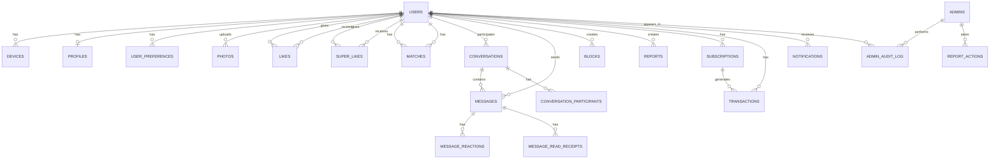

# Database Design

## Connecta — Database Schema & Design

**Version:** 1.0.0
**Date:** July 2026

---

## 1. Database Overview

| Component | Technology | Purpose |
|---|---|---|
| Primary Database | PostgreSQL 15+ | All structured data |
| Cache Layer | Redis 7+ | Sessions, hot data, rate limits |
| Search Engine | Elasticsearch 8+ / Meilisearch | Full-text search, autocomplete |
| Offline Storage | SQLite (SQLCipher) | Mobile device local database |
| Object Storage | AWS S3 / Cloudflare R2 | Photos, media, encrypted message blobs |

### 1.1 Schema Strategy

PostgreSQL uses **schema-per-domain** for logical separation:

```
connecta_db
├── auth          → Authentication, tokens, devices
├── users         → User accounts, preferences
├── profiles      → Profile data, photos, verification
├── matching      → Likes, passes, super-likes, matches
├── messaging     → Conversations, messages, reactions
├── calls         → Call history, call events
├── payments      → Subscriptions, transactions, receipts
├── notifications → Notification log, preferences
├── admin         → Admin users, audit log, settings
└── analytics     → Events, aggregates (partitioned)
```

---

## 2. Entity Relationship Diagram



---

## 3. Complete Database Schema

### 3.1 Auth Schema

```sql
-- =====================================================
-- AUTH SCHEMA
-- =====================================================

CREATE SCHEMA IF NOT EXISTS auth;

-- Users table (authentication core)
CREATE TABLE auth.users (
    id              UUID PRIMARY KEY DEFAULT gen_random_uuid(),
    email           VARCHAR(255) UNIQUE,
    phone           VARCHAR(20) UNIQUE,
    phone_country   VARCHAR(5) DEFAULT '+234',
    password_hash   VARCHAR(255),
    auth_provider   VARCHAR(20) DEFAULT 'local', -- local, google, apple, facebook
    provider_id     VARCHAR(255),
    email_verified  BOOLEAN DEFAULT FALSE,
    phone_verified  BOOLEAN DEFAULT FALSE,
    is_active       BOOLEAN DEFAULT TRUE,
    is_banned       BOOLEAN DEFAULT FALSE,
    ban_reason      TEXT,
    last_login_at   TIMESTAMPTZ,
    created_at      TIMESTAMPTZ DEFAULT NOW(),
    updated_at      TIMESTAMPTZ DEFAULT NOW()
);

CREATE INDEX idx_auth_users_email ON auth.users(email);
CREATE INDEX idx_auth_users_phone ON auth.users(phone);
CREATE INDEX idx_auth_users_provider ON auth.users(auth_provider, provider_id);

-- Refresh tokens
CREATE TABLE auth.refresh_tokens (
    id              UUID PRIMARY KEY DEFAULT gen_random_uuid(),
    user_id         UUID NOT NULL REFERENCES auth.users(id) ON DELETE CASCADE,
    token_hash      VARCHAR(255) NOT NULL,
    device_id       UUID,
    ip_address      INET,
    user_agent      TEXT,
    expires_at      TIMESTAMPTZ NOT NULL,
    revoked_at      TIMESTAMPTZ,
    created_at      TIMESTAMPTZ DEFAULT NOW()
);

CREATE INDEX idx_refresh_tokens_user ON auth.refresh_tokens(user_id);
CREATE INDEX idx_refresh_tokens_hash ON auth.refresh_tokens(token_hash);

-- OTP codes
CREATE TABLE auth.otp_codes (
    id              UUID PRIMARY KEY DEFAULT gen_random_uuid(),
    user_id         UUID REFERENCES auth.users(id) ON DELETE CASCADE,
    phone           VARCHAR(20),
    email           VARCHAR(255),
    code            VARCHAR(10) NOT NULL,
    purpose         VARCHAR(20) NOT NULL, -- registration, login, password_reset
    attempts        INT DEFAULT 0,
    max_attempts    INT DEFAULT 3,
    expires_at      TIMESTAMPTZ NOT NULL,
    verified_at     TIMESTAMPTZ,
    created_at      TIMESTAMPTZ DEFAULT NOW()
);

CREATE INDEX idx_otp_phone ON auth.otp_codes(phone, purpose);
CREATE INDEX idx_otp_email ON auth.otp_codes(email, purpose);

-- Devices (multi-device support)
CREATE TABLE auth.devices (
    id              UUID PRIMARY KEY DEFAULT gen_random_uuid(),
    user_id         UUID NOT NULL REFERENCES auth.users(id) ON DELETE CASCADE,
    device_type     VARCHAR(20) NOT NULL, -- ios, android, web
    device_name     VARCHAR(100),
    device_model    VARCHAR(100),
    os_version      VARCHAR(20),
    app_version     VARCHAR(20),
    fcm_token       TEXT,
    apns_token      TEXT,
    push_enabled    BOOLEAN DEFAULT TRUE,
    last_active_at  TIMESTAMPTZ DEFAULT NOW(),
    created_at      TIMESTAMPTZ DEFAULT NOW(),
    revoked_at      TIMESTAMPTZ
);

CREATE INDEX idx_devices_user ON auth.devices(user_id);

-- Encryption keys (Signal Protocol)
CREATE TABLE auth.user_keys (
    id              UUID PRIMARY KEY DEFAULT gen_random_uuid(),
    user_id         UUID NOT NULL REFERENCES auth.users(id) ON DELETE CASCADE,
    device_id       UUID NOT NULL REFERENCES auth.devices(id) ON DELETE CASCADE,
    identity_key    TEXT NOT NULL,
    signed_pre_key  TEXT NOT NULL,
    signed_pre_key_id INT NOT NULL,
    one_time_pre_keys TEXT[], -- array of one-time pre-keys
    created_at      TIMESTAMPTZ DEFAULT NOW(),
    rotated_at      TIMESTAMPTZ DEFAULT NOW()
);

CREATE INDEX idx_user_keys_user ON auth.user_keys(user_id);
CREATE UNIQUE INDEX idx_user_keys_device ON auth.user_keys(user_id, device_id);

-- Biometric authentication
CREATE TABLE auth.biometric_credentials (
    id              UUID PRIMARY KEY DEFAULT gen_random_uuid(),
    user_id         UUID NOT NULL REFERENCES auth.users(id) ON DELETE CASCADE,
    device_id       UUID NOT NULL REFERENCES auth.devices(id) ON DELETE CASCADE,
    biometric_type  VARCHAR(20) NOT NULL, -- face_id, fingerprint
    credential_id   TEXT NOT NULL,
    public_key      TEXT NOT NULL,
    created_at      TIMESTAMPTZ DEFAULT NOW()
);

CREATE INDEX idx_biometric_user ON auth.biometric_credentials(user_id);
```

### 3.2 Users Schema

```sql
-- =====================================================
-- USERS SCHEMA
-- =====================================================

CREATE SCHEMA IF NOT EXISTS users;

-- Main user profile
CREATE TABLE users.profiles (
    id                  UUID PRIMARY KEY REFERENCES auth.users(id) ON DELETE CASCADE,
    first_name          VARCHAR(50) NOT NULL,
    last_name           VARCHAR(50),
    display_name        VARCHAR(100),
    date_of_birth       DATE NOT NULL,
    gender              VARCHAR(20) NOT NULL, -- male, female, non_binary
    bio                 VARCHAR(500),
    job_title           VARCHAR(100),
    company             VARCHAR(100),
    education           VARCHAR(100),
    university          VARCHAR(100),
    height_cm           INT,
    looking_for         VARCHAR(20) DEFAULT 'relationship', -- relationship, casual, friendship, unspecified
    relationship_goals  VARCHAR(20) DEFAULT 'serious', -- serious, casual, friendship, not_sure
    
    -- Lifestyle
    smoking             VARCHAR(20), -- never, sometimes, socially, regularly
    drinking            VARCHAR(20), -- never, sometimes, socially, regularly
    exercise            VARCHAR(20), -- never, sometimes, often, very_active
    diet                VARCHAR(20), -- no_preference, vegetarian, vegan, halal, kosher
    religion            VARCHAR(50),
    political_views     VARCHAR(50),
    zodiac_sign         VARCHAR(20),
    
    -- Location
    city                VARCHAR(100),
    state               VARCHAR(100),
    country             VARCHAR(100) DEFAULT 'Nigeria',
    latitude            DECIMAL(10, 8),
    longitude           DECIMAL(11, 8),
    location_updated_at TIMESTAMPTZ,
    
    -- Verification & Trust
    is_verified         BOOLEAN DEFAULT FALSE,
    verification_badge  VARCHAR(20), -- none, photo, id, premium
    profile_score       DECIMAL(3, 2) DEFAULT 0.00, -- 0.00 to 1.00
    ai_safety_score     DECIMAL(3, 2) DEFAULT 0.00, -- 0.00 to 1.00
    
    -- Status
    is_visible          BOOLEAN DEFAULT TRUE,
    is_paused           BOOLEAN DEFAULT FALSE,
    pause_reason        VARCHAR(50),
    
    -- Stats
    total_likes_given   INT DEFAULT 0,
    total_likes_received INT DEFAULT 0,
    total_matches       INT DEFAULT 0,
    total_messages_sent INT DEFAULT 0,
    
    -- Timestamps
    last_active_at      TIMESTAMPTZ DEFAULT NOW(),
    last_profile_edit   TIMESTAMPTZ DEFAULT NOW(),
    created_at          TIMESTAMPTZ DEFAULT NOW(),
    updated_at          TIMESTAMPTZ DEFAULT NOW()
);

CREATE INDEX idx_profiles_gender ON users.profiles(gender);
CREATE INDEX idx_profiles_location ON users.profiles(latitude, longitude);
CREATE INDEX idx_profiles_city ON users.profiles(city, country);
CREATE INDEX idx_profiles_active ON users.profiles(last_active_at) WHERE is_visible = TRUE AND is_paused = FALSE;
CREATE INDEX idx_profiles_score ON users.profiles(profile_score DESC);

-- User preferences (discovery settings)
CREATE TABLE users.preferences (
    id                  UUID PRIMARY KEY DEFAULT gen_random_uuid(),
    user_id             UUID NOT NULL UNIQUE REFERENCES auth.users(id) ON DELETE CASCADE,
    age_min             INT DEFAULT 18,
    age_max             INT DEFAULT 50,
    distance_max_km     INT DEFAULT 50,
    show_me             VARCHAR(20) DEFAULT 'opposite', -- opposite, same, both
    education_pref      VARCHAR(20)[] DEFAULT '{}',
    lifestyle_pref      JSONB DEFAULT '{}',
    interest_pref       VARCHAR(50)[] DEFAULT '{}',
    dealbreakers        VARCHAR(50)[] DEFAULT '{}',
    show_verified_only  BOOLEAN DEFAULT FALSE,
    show_profiles_with_photos_only BOOLEAN DEFAULT TRUE,
    global_discovery    BOOLEAN DEFAULT FALSE,
    created_at          TIMESTAMPTZ DEFAULT NOW(),
    updated_at          TIMESTAMPTZ DEFAULT NOW()
);

-- Interest tags
CREATE TABLE users.interests (
    id              UUID PRIMARY KEY DEFAULT gen_random_uuid(),
    name            VARCHAR(50) NOT NULL UNIQUE,
    category        VARCHAR(50),
    icon            VARCHAR(10),
    is_active       BOOLEAN DEFAULT TRUE,
    sort_order      INT DEFAULT 0
);

CREATE TABLE users.user_interests (
    user_id         UUID NOT NULL REFERENCES auth.users(id) ON DELETE CASCADE,
    interest_id     UUID NOT NULL REFERENCES users.interests(id) ON DELETE CASCADE,
    PRIMARY KEY (user_id, interest_id)
);

-- User blocks
CREATE TABLE users.blocks (
    id              UUID PRIMARY KEY DEFAULT gen_random_uuid(),
    blocker_id      UUID NOT NULL REFERENCES auth.users(id) ON DELETE CASCADE,
    blocked_id      UUID NOT NULL REFERENCES auth.users(id) ON DELETE CASCADE,
    reason          VARCHAR(50),
    created_at      TIMESTAMPTZ DEFAULT NOW(),
    UNIQUE(blocker_id, blocked_id)
);

CREATE INDEX idx_blocks_blocker ON users.blocks(blocker_id);
CREATE INDEX idx_blocks_blocked ON users.blocks(blocked_id);

-- User reports
CREATE TABLE users.reports (
    id              UUID PRIMARY KEY DEFAULT gen_random_uuid(),
    reporter_id     UUID NOT NULL REFERENCES auth.users(id) ON DELETE CASCADE,
    reported_id     UUID NOT NULL REFERENCES auth.users(id) ON DELETE CASCADE,
    reason          VARCHAR(50) NOT NULL, -- fake_profile, inappropriate_content, scam, harassment, other
    description     TEXT,
    message_id      UUID, -- optional: specific message being reported
    evidence_urls   TEXT[], -- optional: screenshots
    status          VARCHAR(20) DEFAULT 'pending', -- pending, reviewing, resolved, dismissed
    ai_score        DECIMAL(3, 2), -- AI priority score
    reviewed_by     UUID REFERENCES auth.admins(id),
    action_taken    VARCHAR(50), -- none, warning, suspension, ban
    action_note     TEXT,
    resolved_at     TIMESTAMPTZ,
    created_at      TIMESTAMPTZ DEFAULT NOW()
);

CREATE INDEX idx_reports_status ON users.reports(status, ai_score DESC);
CREATE INDEX idx_reports_reported ON users.reports(reported_id);
```

### 3.3 Profiles Schema (Photos)

```sql
-- =====================================================
-- PROFILES SCHEMA
-- =====================================================

CREATE SCHEMA IF NOT EXISTS profiles;

-- User photos
CREATE TABLE profiles.photos (
    id              UUID PRIMARY KEY DEFAULT gen_random_uuid(),
    user_id         UUID NOT NULL REFERENCES auth.users(id) ON DELETE CASCADE,
    url             TEXT NOT NULL,
    thumbnail_url   TEXT,
    storage_key     VARCHAR(255) NOT NULL,
    width           INT,
    height          INT,
    file_size       INT, -- bytes
    mime_type       VARCHAR(50),
    sort_order      INT DEFAULT 0,
    is_primary      BOOLEAN DEFAULT FALSE,
    is_verified     BOOLEAN DEFAULT FALSE,
    verification_status VARCHAR(20) DEFAULT 'pending', -- pending, approved, rejected
    ai_flags        JSONB DEFAULT '{}', -- AI moderation flags
    created_at      TIMESTAMPTZ DEFAULT NOW()
);

CREATE INDEX idx_photos_user ON profiles.photos(user_id, sort_order);

-- Photo verification requests
CREATE TABLE profiles.photo_verifications (
    id              UUID PRIMARY KEY DEFAULT gen_random_uuid(),
    user_id         UUID NOT NULL REFERENCES auth.users(id) ON DELETE CASCADE,
    photo_id        UUID NOT NULL REFERENCES profiles.photos(id) ON DELETE CASCADE,
    selfie_url      TEXT NOT NULL,
    status          VARCHAR(20) DEFAULT 'pending', -- pending, approved, rejected
    confidence      DECIMAL(3, 2),
    reviewed_by     UUID REFERENCES auth.admins(id),
    created_at      TIMESTAMPTZ DEFAULT NOW(),
    resolved_at     TIMESTAMPTZ
);
```

### 3.4 Matching Schema

```sql
-- =====================================================
-- MATCHING SCHEMA
-- =====================================================

CREATE SCHEMA IF NOT EXISTS matching;

-- Likes (swipes right)
CREATE TABLE matching.likes (
    id              UUID PRIMARY KEY DEFAULT gen_random_uuid(),
    user_id         UUID NOT NULL REFERENCES auth.users(id) ON DELETE CASCADE,
    liked_user_id   UUID NOT NULL REFERENCES auth.users(id) ON DELETE CASCADE,
    is_super_like   BOOLEAN DEFAULT FALSE,
    created_at      TIMESTAMPTZ DEFAULT NOW(),
    UNIQUE(user_id, liked_user_id)
);

CREATE INDEX idx_likes_user ON matching.likes(user_id);
CREATE INDEX idx_likes_liked ON matching.likes(liked_user_id);
CREATE INDEX idx_likes_created ON matching.likes(created_at);

-- Passes (swipes left)
CREATE TABLE matching.passes (
    id              UUID PRIMARY KEY DEFAULT gen_random_uuid(),
    user_id         UUID NOT NULL REFERENCES auth.users(id) ON DELETE CASCADE,
    passed_user_id  UUID NOT NULL REFERENCES auth.users(id) ON DELETE CASCADE,
    created_at      TIMESTAMPTZ DEFAULT NOW(),
    UNIQUE(user_id, passed_user_id)
);

CREATE INDEX idx_passes_user ON matching.passes(user_id);

-- Matches (mutual likes)
CREATE TABLE matching.matches (
    id              UUID PRIMARY KEY DEFAULT gen_random_uuid(),
    user_a_id       UUID NOT NULL REFERENCES auth.users(id) ON DELETE CASCADE,
    user_b_id       UUID NOT NULL REFERENCES auth.users(id) ON DELETE CASCADE,
    conversation_id UUID, -- linked to messaging.conversations
    matched_at      TIMESTAMPTZ DEFAULT NOW(),
    is_active       BOOLEAN DEFAULT TRUE,
    matched_via     VARCHAR(20) DEFAULT 'like', -- like, super_like, boost
    ai_score        DECIMAL(3, 2), -- compatibility score at time of match
    UNIQUE(user_a_id, user_b_id)
);

CREATE INDEX idx_matches_user_a ON matching.matches(user_a_id) WHERE is_active = TRUE;
CREATE INDEX idx_matches_user_b ON matching.matches(user_b_id) WHERE is_active = TRUE;
CREATE INDEX idx_matches_matched ON matching.matches(matched_at DESC);

-- Like limits (daily tracking)
CREATE TABLE matching.daily_likes (
    id              UUID PRIMARY KEY DEFAULT gen_random_uuid(),
    user_id         UUID NOT NULL REFERENCES auth.users(id) ON DELETE CASCADE,
    date            DATE NOT NULL DEFAULT CURRENT_DATE,
    likes_given     INT DEFAULT 0,
    super_likes_given INT DEFAULT 0,
    UNIQUE(user_id, date)
);

CREATE INDEX idx_daily_likes_user_date ON matching.daily_likes(user_id, date);

-- Profile boosts
CREATE TABLE matching.boosts (
    id              UUID PRIMARY KEY DEFAULT gen_random_uuid(),
    user_id         UUID NOT NULL REFERENCES auth.users(id) ON DELETE CASCADE,
    started_at      TIMESTAMPTZ DEFAULT NOW(),
    expires_at      TIMESTAMPTZ NOT NULL,
    views_gained    INT DEFAULT 0,
    likes_gained    INT DEFAULT 0,
    is_active       BOOLEAN DEFAULT TRUE
);

CREATE INDEX idx_boosts_active ON matching.boosts(user_id, is_active);
```

### 3.5 Messaging Schema

```sql
-- =====================================================
-- MESSAGING SCHEMA
-- =====================================================

CREATE SCHEMA IF NOT EXISTS messaging;

-- Conversations
CREATE TABLE messaging.conversations (
    id              UUID PRIMARY KEY DEFAULT gen_random_uuid(),
    type            VARCHAR(20) DEFAULT 'direct', -- direct, group (future)
    last_message_id UUID,
    last_message_at TIMESTAMPTZ,
    created_at      TIMESTAMPTZ DEFAULT NOW()
);

-- Conversation participants
CREATE TABLE messaging.conversation_participants (
    id              UUID PRIMARY KEY DEFAULT gen_random_uuid(),
    conversation_id UUID NOT NULL REFERENCES messaging.conversations(id) ON DELETE CASCADE,
    user_id         UUID NOT NULL REFERENCES auth.users(id) ON DELETE CASCADE,
    joined_at       TIMESTAMPTZ DEFAULT NOW(),
    left_at         TIMESTAMPTZ,
    last_read_at    TIMESTAMPTZ,
    unread_count    INT DEFAULT 0,
    is_muted        BOOLEAN DEFAULT FALSE,
    UNIQUE(conversation_id, user_id)
);

CREATE INDEX idx_conv_participants_user ON messaging.conversation_participants(user_id);
CREATE INDEX idx_conv_participants_conv ON messaging.conversation_participants(conversation_id);

-- Messages
CREATE TABLE messaging.messages (
    id              UUID PRIMARY KEY DEFAULT gen_random_uuid(),
    conversation_id UUID NOT NULL REFERENCES messaging.conversations(id) ON DELETE CASCADE,
    sender_id       UUID NOT NULL REFERENCES auth.users(id) ON DELETE CASCADE,
    content_type    VARCHAR(20) NOT NULL, -- text, image, voice, video, file, system
    content         TEXT, -- text content or caption
    media_url       TEXT, -- for image/video/file/voice
    media_key       VARCHAR(255), -- encrypted storage key
    thumbnail_url   TEXT,
    file_size       INT,
    duration        INT, -- for voice/video (seconds)
    reply_to_id     UUID REFERENCES messaging.messages(id),
    is_deleted      BOOLEAN DEFAULT FALSE,
    deleted_by      UUID,
    deleted_at      TIMESTAMPTZ,
    is_edited       BOOLEAN DEFAULT FALSE,
    edited_at       TIMESTAMPTZ,
    created_at      TIMESTAMPTZ DEFAULT NOW()
);

CREATE INDEX idx_messages_conv ON messaging.messages(conversation_id, created_at DESC);
CREATE INDEX idx_messages_sender ON messaging.messages(sender_id);
CREATE INDEX idx_messages_created ON messaging.messages(created_at);

-- Message reactions
CREATE TABLE messaging.message_reactions (
    id              UUID PRIMARY KEY DEFAULT gen_random_uuid(),
    message_id      UUID NOT NULL REFERENCES messaging.messages(id) ON DELETE CASCADE,
    user_id         UUID NOT NULL REFERENCES auth.users(id) ON DELETE CASCADE,
    emoji           VARCHAR(10) NOT NULL,
    created_at      TIMESTAMPTZ DEFAULT NOW(),
    UNIQUE(message_id, user_id, emoji)
);

CREATE INDEX idx_reactions_message ON messaging.message_reactions(message_id);

-- Read receipts
CREATE TABLE messaging.read_receipts (
    id              UUID PRIMARY KEY DEFAULT gen_random_uuid(),
    message_id      UUID NOT NULL REFERENCES messaging.messages(id) ON DELETE CASCADE,
    user_id         UUID NOT NULL REFERENCES auth.users(id) ON DELETE CASCADE,
    read_at         TIMESTAMPTZ DEFAULT NOW(),
    UNIQUE(message_id, user_id)
);

CREATE INDEX idx_read_receipts_message ON messaging.read_receipts(message_id);

-- Message sync status (for offline sync)
CREATE TABLE messaging.sync_log (
    id              UUID PRIMARY KEY DEFAULT gen_random_uuid(),
    user_id         UUID NOT NULL REFERENCES auth.users(id) ON DELETE CASCADE,
    device_id       UUID NOT NULL,
    message_id      UUID NOT NULL REFERENCES messaging.messages(id) ON DELETE CASCADE,
    sync_status     VARCHAR(20) DEFAULT 'pending', -- pending, synced, failed
    sync_attempts   INT DEFAULT 0,
    last_sync_at    TIMESTAMPTZ,
    created_at      TIMESTAMPTZ DEFAULT NOW()
);

CREATE INDEX idx_sync_log_user ON messaging.sync_log(user_id, sync_status);
```

### 3.6 Calls Schema

```sql
-- =====================================================
-- CALLS SCHEMA
-- =====================================================

CREATE SCHEMA IF NOT EXISTS calls;

-- Call sessions
CREATE TABLE calls.call_sessions (
    id              UUID PRIMARY KEY DEFAULT gen_random_uuid(),
    caller_id       UUID NOT NULL REFERENCES auth.users(id),
    callee_id       UUID NOT NULL REFERENCES auth.users(id),
    call_type       VARCHAR(20) NOT NULL, -- voice, video
    status          VARCHAR(20) DEFAULT 'ringing', -- ringing, connected, completed, missed, rejected, failed
    started_at      TIMESTAMPTZ DEFAULT NOW(),
    connected_at    TIMESTAMPTZ,
    ended_at        TIMESTAMPTZ,
    duration        INT, -- seconds
    end_reason      VARCHAR(50), -- normal, network_error, user_hangup, timeout
    quality_score   DECIMAL(3, 2), -- 0.00 to 1.00
    ice_servers_used INT,
    created_at      TIMESTAMPTZ DEFAULT NOW()
);

CREATE INDEX idx_calls_caller ON calls.call_sessions(caller_id, created_at DESC);
CREATE INDEX idx_calls_callee ON calls.call_sessions(callee_id, created_at DESC);
CREATE INDEX idx_calls_status ON calls.call_sessions(status);

-- Call events (for debugging)
CREATE TABLE calls.call_events (
    id              UUID PRIMARY KEY DEFAULT gen_random_uuid(),
    call_id         UUID NOT NULL REFERENCES calls.call_sessions(id) ON DELETE CASCADE,
    event_type      VARCHAR(50) NOT NULL, -- ice_candidate, quality_change, reconnect, etc.
    event_data      JSONB,
    created_at      TIMESTAMPTZ DEFAULT NOW()
);

CREATE INDEX idx_call_events_call ON calls.call_events(call_id, created_at);
```

### 3.7 Payments Schema

```sql
-- =====================================================
-- PAYMENTS SCHEMA
-- =====================================================

CREATE SCHEMA IF NOT EXISTS payments;

-- Subscription plans
CREATE TABLE payments.plans (
    id              UUID PRIMARY KEY DEFAULT gen_random_uuid(),
    name            VARCHAR(50) NOT NULL, -- free, premium, gold, platinum
    display_name    VARCHAR(100) NOT NULL,
    description     TEXT,
    price_monthly   DECIMAL(10, 2) NOT NULL,
    price_yearly    DECIMAL(10, 2),
    currency        VARCHAR(3) DEFAULT 'NGN',
    features        JSONB NOT NULL, -- feature flags
    daily_likes     INT,
    daily_super_likes INT,
    is_active       BOOLEAN DEFAULT TRUE,
    sort_order      INT DEFAULT 0,
    created_at      TIMESTAMPTZ DEFAULT NOW()
);

-- User subscriptions
CREATE TABLE payments.subscriptions (
    id              UUID PRIMARY KEY DEFAULT gen_random_uuid(),
    user_id         UUID NOT NULL REFERENCES auth.users(id) ON DELETE CASCADE,
    plan_id         UUID NOT NULL REFERENCES payments.plans(id),
    status          VARCHAR(20) DEFAULT 'active', -- active, cancelled, expired, paused
    billing_period  VARCHAR(20) DEFAULT 'monthly', -- monthly, yearly
    started_at      TIMESTAMPTZ DEFAULT NOW(),
    current_period_start TIMESTAMPTZ,
    current_period_end TIMESTAMPTZ,
    cancelled_at    TIMESTAMPTZ,
    cancel_reason   TEXT,
    auto_renew      BOOLEAN DEFAULT TRUE,
    created_at      TIMESTAMPTZ DEFAULT NOW()
);

CREATE INDEX idx_subscriptions_user ON payments.subscriptions(user_id);
CREATE INDEX idx_subscriptions_status ON payments.subscriptions(status, current_period_end);

-- Payment transactions
CREATE TABLE payments.transactions (
    id              UUID PRIMARY KEY DEFAULT gen_random_uuid(),
    user_id         UUID NOT NULL REFERENCES auth.users(id),
    subscription_id UUID REFERENCES payments.subscriptions(id),
    type            VARCHAR(30) NOT NULL, -- subscription, super_likes, boost, virtual_gift
    amount          DECIMAL(10, 2) NOT NULL,
    currency        VARCHAR(3) DEFAULT 'NGN',
    status          VARCHAR(20) DEFAULT 'pending', -- pending, processing, completed, failed, refunded
    payment_method  VARCHAR(30), -- card, bank_transfer, mobile_money, ussd
    gateway         VARCHAR(30), -- paystack, flutterwave
    gateway_ref     VARCHAR(255), -- gateway transaction reference
    gateway_response JSONB,
    metadata        JSONB DEFAULT '{}',
    created_at      TIMESTAMPTZ DEFAULT NOW(),
    completed_at    TIMESTAMPTZ
);

CREATE INDEX idx_transactions_user ON payments.transactions(user_id, created_at DESC);
CREATE INDEX idx_transactions_status ON payments.transactions(status);
CREATE INDEX idx_transactions_gateway ON payments.transactions(gateway, gateway_ref);

-- Receipts
CREATE TABLE payments.receipts (
    id              UUID PRIMARY KEY DEFAULT gen_random_uuid(),
    transaction_id  UUID NOT NULL REFERENCES payments.transactions(id),
    user_id         UUID NOT NULL REFERENCES auth.users(id),
    receipt_number  VARCHAR(50) NOT NULL UNIQUE,
    amount          DECIMAL(10, 2) NOT NULL,
    currency        VARCHAR(3) DEFAULT 'NGN',
    description     TEXT,
    issued_at       TIMESTAMPTZ DEFAULT NOW(),
    pdf_url         TEXT
);

CREATE INDEX idx_receipts_user ON payments.receipts(user_id, issued_at DESC);
```

### 3.8 Notifications Schema

```sql
-- =====================================================
-- NOTIFICATIONS SCHEMA
-- =====================================================

CREATE SCHEMA IF NOT EXISTS notifications;

-- Notification log
CREATE TABLE notifications.notifications (
    id              UUID PRIMARY KEY DEFAULT gen_random_uuid(),
    user_id         UUID NOT NULL REFERENCES auth.users(id) ON DELETE CASCADE,
    type            VARCHAR(50) NOT NULL, -- match, message, like, super_like, call, subscription, system
    title           VARCHAR(200) NOT NULL,
    body            TEXT NOT NULL,
    data            JSONB DEFAULT '{}', -- deep link data
    channel         VARCHAR(20) NOT NULL, -- push, in_app, email
    status          VARCHAR(20) DEFAULT 'pending', -- pending, sent, delivered, read, failed
    read_at         TIMESTAMPTZ,
    sent_at         TIMESTAMPTZ,
    created_at      TIMESTAMPTZ DEFAULT NOW()
);

CREATE INDEX idx_notifications_user ON notifications.notifications(user_id, created_at DESC);
CREATE INDEX idx_notifications_unread ON notifications.notifications(user_id, status) WHERE status != 'read';

-- Notification preferences
CREATE TABLE notifications.preferences (
    id              UUID PRIMARY KEY DEFAULT gen_random_uuid(),
    user_id         UUID NOT NULL UNIQUE REFERENCES auth.users(id) ON DELETE CASCADE,
    match_notify    BOOLEAN DEFAULT TRUE,
    message_notify  BOOLEAN DEFAULT TRUE,
    like_notify     BOOLEAN DEFAULT TRUE,
    super_like_notify BOOLEAN DEFAULT TRUE,
    call_notify     BOOLEAN DEFAULT TRUE,
    subscription_notify BOOLEAN DEFAULT TRUE,
    marketing_notify BOOLEAN DEFAULT FALSE,
    quiet_hours_start TIME,
    quiet_hours_end   TIME,
    created_at      TIMESTAMPTZ DEFAULT NOW(),
    updated_at      TIMESTAMPTZ DEFAULT NOW()
);
```

### 3.9 Admin Schema

```sql
-- =====================================================
-- ADMIN SCHEMA
-- =====================================================

CREATE SCHEMA IF NOT EXISTS admin;

-- Admin users
CREATE TABLE admin.admin_users (
    id              UUID PRIMARY KEY DEFAULT gen_random_uuid(),
    email           VARCHAR(255) NOT NULL UNIQUE,
    password_hash   VARCHAR(255) NOT NULL,
    name            VARCHAR(100) NOT NULL,
    role            VARCHAR(20) NOT NULL DEFAULT 'moderator', -- super_admin, moderator
    is_active       BOOLEAN DEFAULT TRUE,
    tfa_enabled     BOOLEAN DEFAULT FALSE,
    tfa_secret      VARCHAR(255),
    last_login_at   TIMESTAMPTZ,
    created_at      TIMESTAMPTZ DEFAULT NOW(),
    updated_at      TIMESTAMPTZ DEFAULT NOW()
);

-- Admin sessions
CREATE TABLE admin.admin_sessions (
    id              UUID PRIMARY KEY DEFAULT gen_random_uuid(),
    admin_id        UUID NOT NULL REFERENCES admin.admin_users(id) ON DELETE CASCADE,
    token_hash      VARCHAR(255) NOT NULL,
    ip_address      INET,
    user_agent      TEXT,
    expires_at      TIMESTAMPTZ NOT NULL,
    created_at      TIMESTAMPTZ DEFAULT NOW()
);

CREATE INDEX idx_admin_sessions_admin ON admin.admin_sessions(admin_id);

-- Admin audit log
CREATE TABLE admin.audit_log (
    id              UUID PRIMARY KEY DEFAULT gen_random_uuid(),
    admin_id        UUID NOT NULL REFERENCES admin.admin_users(id),
    action          VARCHAR(100) NOT NULL, -- user.suspend, user.ban, report.resolve, etc.
    target_type     VARCHAR(50), -- user, report, message, setting
    target_id       UUID,
    details         JSONB DEFAULT '{}',
    ip_address      INET,
    created_at      TIMESTAMPTZ DEFAULT NOW()
);

CREATE INDEX idx_audit_log_admin ON admin.audit_log(admin_id, created_at DESC);
CREATE INDEX idx_audit_log_action ON admin.audit_log(action, created_at DESC);
CREATE INDEX idx_audit_log_target ON admin.audit_log(target_type, target_id);

-- System settings
CREATE TABLE admin.system_settings (
    id              UUID PRIMARY KEY DEFAULT gen_random_uuid(),
    key             VARCHAR(100) NOT NULL UNIQUE,
    value           JSONB NOT NULL,
    description     TEXT,
    updated_by      UUID REFERENCES admin.admin_users(id),
    updated_at      TIMESTAMPTZ DEFAULT NOW()
);

-- Feature flags
CREATE TABLE admin.feature_flags (
    id              UUID PRIMARY KEY DEFAULT gen_random_uuid(),
    name            VARCHAR(100) NOT NULL UNIQUE,
    description     TEXT,
    is_enabled      BOOLEAN DEFAULT FALSE,
    rollout_percentage INT DEFAULT 100, -- 0-100
    allowed_users   UUID[] DEFAULT '{}', -- specific users
    denied_users    UUID[] DEFAULT '{}',
    created_at      TIMESTAMPTZ DEFAULT NOW(),
    updated_at      TIMESTAMPTZ DEFAULT NOW()
);
```

### 3.10 Analytics Schema

```sql
-- =====================================================
-- ANALYTICS SCHEMA (Partitioned)
-- =====================================================

CREATE SCHEMA IF NOT EXISTS analytics;

-- User events (partitioned by month)
CREATE TABLE analytics.user_events (
    id              UUID DEFAULT gen_random_uuid(),
    user_id         UUID NOT NULL,
    event_type      VARCHAR(50) NOT NULL, -- app_open, profile_view, swipe_right, message_sent, etc.
    event_data      JSONB DEFAULT '{}',
    session_id      UUID,
    device_type     VARCHAR(20),
    app_version     VARCHAR(20),
    created_at      TIMESTAMPTZ DEFAULT NOW() NOT NULL,
    PRIMARY KEY (id, created_at)
) PARTITION BY RANGE (created_at);

-- Create partitions (example: monthly)
CREATE TABLE analytics.user_events_2026_07 PARTITION OF analytics.user_events
    FOR VALUES FROM ('2026-07-01') TO ('2026-08-01');
CREATE TABLE analytics.user_events_2026_08 PARTITION OF analytics.user_events
    FOR VALUES FROM ('2026-08-01') TO ('2026-09-01');
-- ... additional partitions created by cron job

CREATE INDEX idx_events_user ON analytics.user_events(user_id, created_at);
CREATE INDEX idx_events_type ON analytics.user_events(event_type, created_at);
CREATE INDEX idx_events_session ON analytics.user_events(session_id);

-- Daily aggregates (materialized views)
CREATE MATERIALIZED VIEW analytics.daily_user_metrics AS
SELECT
    DATE(created_at) as date,
    COUNT(DISTINCT user_id) as dau,
    COUNT(*) FILTER (WHERE event_type = 'app_open') as app_opens,
    COUNT(*) FILTER (WHERE event_type = 'swipe_right') as likes,
    COUNT(*) FILTER (WHERE event_type = 'swipe_left') as passes,
    COUNT(*) FILTER (WHERE event_type = 'match_created') as matches,
    COUNT(*) FILTER (WHERE event_type = 'message_sent') as messages_sent
FROM analytics.user_events
GROUP BY DATE(created_at)
WITH DATA;

-- Revenue metrics
CREATE MATERIALIZED VIEW analytics.daily_revenue AS
SELECT
    DATE(completed_at) as date,
    COUNT(*) as transactions,
    SUM(amount) as revenue,
    AVG(amount) as avg_transaction,
    COUNT(DISTINCT user_id) as paying_users
FROM payments.transactions
WHERE status = 'completed'
GROUP BY DATE(completed_at)
WITH DATA;
```

---

## 4. Indexes & Performance

### 4.1 Critical Query Patterns

| Query Pattern | Table | Index |
|---|---|---|
| Feed generation | matching.likes | (user_id, created_at) |
| Conversation list | messaging.conversation_participants | (user_id, unread_count) |
| Message history | messaging.messages | (conversation_id, created_at DESC) |
| User search | users.profiles | GIN on tsvector of name, bio |
| Nearby users | users.profiles | GiST on (latitude, longitude) |
| Report queue | users.reports | (status, ai_score DESC) |
| Daily like count | matching.daily_likes | (user_id, date) |

### 4.2 Partitioning Strategy

- **analytics.user_events** — Monthly range partitioning
- **messaging.messages** — Consider partitioning by conversation_id at 10M+ rows
- **payments.transactions** — Monthly range partitioning at 1M+ rows

### 4.3 Archival Strategy

| Table | Hot Data | Warm Data | Cold/Archive |
|---|---|---|---|
| messages | 30 days | 1 year | S3 glacier |
| events | 30 days | 1 year | S3 glacier |
| transactions | 1 year | 7 years | Encrypted archive |
| notifications | 30 days | 90 days | Delete |

---

## 5. Redis Schema

```yaml
# Session management
session:{userId}:{deviceId}     → JWT payload (TTL: 8h)

# Rate limiting
ratelimit:{endpoint}:{userId}   → count (TTL: 1min/hour)

# OTP
otp:{phone}:{purpose}           → code (TTL: 5min)

# User online status
online:{userId}                 → last_seen timestamp (TTL: 5min)

# Typing indicator
typing:{conversationId}:{userId} → 1 (TTL: 5s)

# Daily likes
likes:daily:{userId}:{date}     → count (TTL: 24h)

# Match feed cache
feed:{userId}                   → [profileIds] (TTL: 5min)

# Compatibility scores
compat:{userId}:{candidateId}   → score (TTL: 1h)

# Dashboard metrics (admin)
dashboard:metrics               → JSON (TTL: 60s)

# Feature flags
featureflags:{flagName}         → enabled (TTL: 300s)
```

---

## 6. SQLite Schema (Mobile Offline)

```sql
-- Mobile local database (SQLCipher encrypted)

CREATE TABLE local_messages (
    id              TEXT PRIMARY KEY,
    conversation_id TEXT NOT NULL,
    sender_id       TEXT NOT NULL,
    content         TEXT,
    content_type    TEXT NOT NULL,
    media_url       TEXT,
    is_deleted      INTEGER DEFAULT 0,
    is_sent         INTEGER DEFAULT 0, -- 0=pending, 1=sent, 2=failed
    created_at      INTEGER NOT NULL, -- unix timestamp
    sent_at         INTEGER
);

CREATE TABLE local_conversations (
    id              TEXT PRIMARY KEY,
    match_id        TEXT,
    other_user_id   TEXT NOT NULL,
    last_message    TEXT,
    last_message_at INTEGER,
    unread_count    INTEGER DEFAULT 0,
    created_at      INTEGER NOT NULL
);

CREATE TABLE local_profile_cache (
    user_id         TEXT PRIMARY KEY,
    data            TEXT NOT NULL, -- JSON
    cached_at       INTEGER NOT NULL
);

CREATE TABLE local_sync_queue (
    id              INTEGER PRIMARY KEY AUTOINCREMENT,
    operation       TEXT NOT NULL, -- INSERT, UPDATE, DELETE
    table_name      TEXT NOT NULL,
    record_id       TEXT NOT NULL,
    data            TEXT, -- JSON
    created_at      INTEGER NOT NULL,
    synced          INTEGER DEFAULT 0
);

-- Encryption key storage (secure)
CREATE TABLE local_keys (
    id              TEXT PRIMARY KEY,
    key_type        TEXT NOT NULL, -- identity, signed_pre, one_time_pre
    key_data        TEXT NOT NULL, -- base64 encoded
    created_at      INTEGER NOT NULL,
    rotated_at      INTEGER
);
```

---

## 7. Migration Strategy

### 7.1 Version Control

All schema changes are managed via migration files:

```
migrations/
├── 001_create_auth_schema.sql
├── 002_create_users_schema.sql
├── 003_create_matching_schema.sql
├── 004_create_messaging_schema.sql
├── 005_create_payments_schema.sql
├── 006_create_admin_schema.sql
├── 007_create_analytics_schema.sql
└── 008_seed_plans_and_interests.sql
```

### 7.2 Migration Rules

1. Never modify production schema directly — use migrations only
2. All migrations must be reversible (up/down)
3. Large table alterations use `pg_repack` or online schema changes
4. New columns with defaults are added in two steps (add column, then set default)
5. Indexes created with `CREATE INDEX CONCURRENTLY` to avoid locks

---

*This document is part of the Connecta Software Design Document (SDD) package.*
