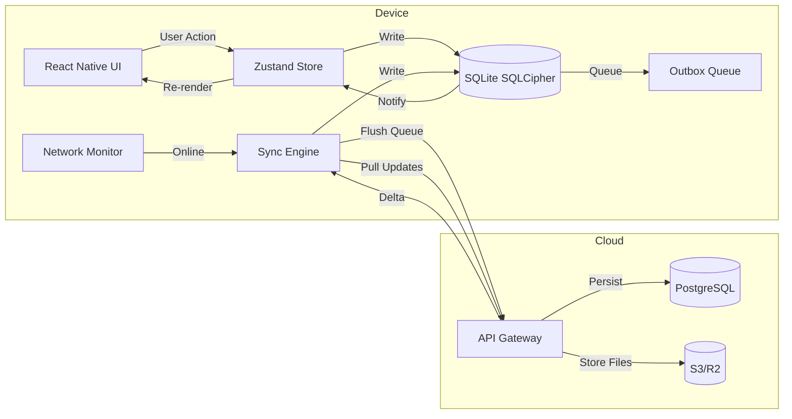
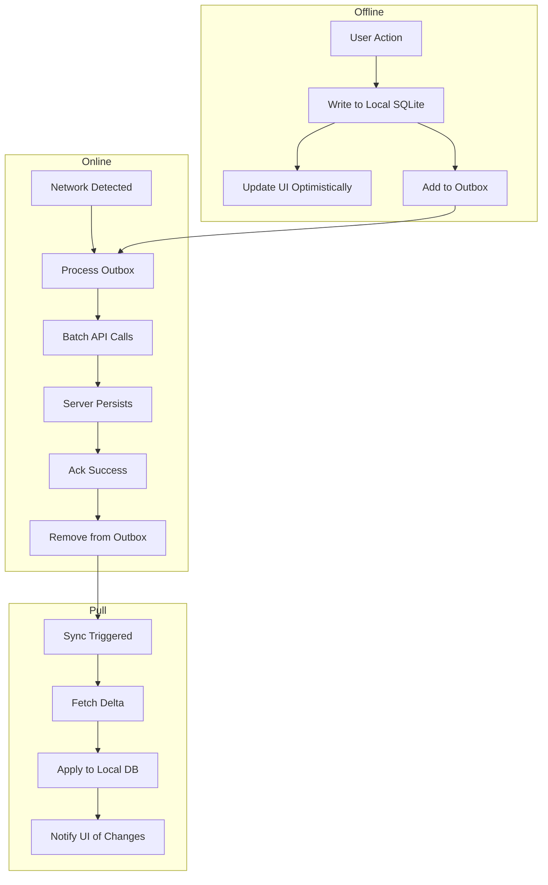

# Offline Synchronization

## OJChat — Offline-First Architecture & Sync Engine

**Version:** 1.0.0
**Date:** July 2026

---

## 1. Architecture Overview

OJChat uses a **local-first architecture** where the mobile client operates independently of the server.

> **Note:** The offline-first architecture described in this document is largely aspirational at this stage. Core messaging and profile viewing are designed to work offline, but full offline sync (outbox pattern, conflict resolution, background sync) is not yet fully implemented in the current codebase. All user actions are written to an encrypted local SQLite database immediately, and synchronization with the cloud happens asynchronously when connectivity is available.

### 1.1 Design Principles

1. **Instant writes** — Every user action writes to local SQLite before any network call
2. **Optimistic UI** — The app shows data as if it's already synced
3. **Background sync** — Synchronization happens automatically when connectivity is detected
4. **Conflict resolution** — Server is authoritative for most data; local wins for user preferences
5. **Encrypted storage** — All local data encrypted with SQLCipher (AES-256)

### 1.2 Sync Flow Diagram



---

## 2. Local Database (SQLite + SQLCipher)

### 2.1 Encryption Setup

```typescript
import SQLite from 'react-native-sqlite-storage';
import { getEncryptionKey } from '../security/keychain';

export async function openDatabase(): Promise<SQLiteDatabase> {
  const key = await getEncryptionKey('local_db');
  const db = await SQLite.openDatabase({
    name: 'ojchat.db',
    key: key,
    location: 'default',
  });
  await db.executeSql('PRAGMA cipher_page_size = 4096');
  await db.executeSql('PRAGMA kdf_iter = 256000');
  await db.executeSql('PRAGMA journal_mode = WAL');
  return db;
}
```

### 2.2 Local Schema

```sql
CREATE TABLE local_conversations (
    id              TEXT PRIMARY KEY,
    match_id        TEXT,
    other_user_id   TEXT NOT NULL,
    other_user_name TEXT,
    other_user_photo TEXT,
    last_message    TEXT,
    last_message_at INTEGER,
    unread_count    INTEGER DEFAULT 0,
    is_archived     INTEGER DEFAULT 0,
    created_at      INTEGER NOT NULL,
    updated_at      INTEGER NOT NULL
);

CREATE TABLE local_messages (
    id              TEXT PRIMARY KEY,
    conversation_id TEXT NOT NULL,
    sender_id       TEXT NOT NULL,
    content         TEXT,
    content_type    TEXT NOT NULL DEFAULT 'text',
    media_url       TEXT,
    media_local_path TEXT,
    reply_to_id     TEXT,
    is_deleted      INTEGER DEFAULT 0,
    is_sent         INTEGER DEFAULT 0,
    is_read         INTEGER DEFAULT 0,
    created_at      INTEGER NOT NULL,
    sent_at         INTEGER,
    updated_at      INTEGER NOT NULL,
    FOREIGN KEY (conversation_id) REFERENCES local_conversations(id)
);

CREATE TABLE local_profile_cache (
    user_id         TEXT PRIMARY KEY,
    data            TEXT NOT NULL,
    version         INTEGER DEFAULT 1,
    cached_at       INTEGER NOT NULL
);

CREATE TABLE local_feed_cache (
    user_id         TEXT PRIMARY KEY,
    data            TEXT NOT NULL,
    score           REAL,
    cached_at       INTEGER NOT NULL
);

CREATE TABLE local_preferences (
    key             TEXT PRIMARY KEY,
    value           TEXT NOT NULL,
    updated_at      INTEGER NOT NULL,
    synced          INTEGER DEFAULT 0
);

CREATE TABLE local_sync_outbox (
    id              INTEGER PRIMARY KEY AUTOINCREMENT,
    operation       TEXT NOT NULL,
    entity_type     TEXT NOT NULL,
    entity_id       TEXT NOT NULL,
    payload         TEXT,
    created_at      INTEGER NOT NULL,
    retry_count     INTEGER DEFAULT 0,
    last_retry_at   INTEGER,
    status          TEXT DEFAULT 'pending'
);

CREATE TABLE local_encryption_keys (
    id              TEXT PRIMARY KEY,
    key_type        TEXT NOT NULL,
    key_data        TEXT NOT NULL,
    associated_data TEXT,
    created_at      INTEGER NOT NULL,
    rotated_at      INTEGER,
    expires_at      INTEGER
);
```

---

## 3. Outbox Pattern

### 3.1 Writing to the Outbox

```typescript
export class Outbox {
  private db: SQLiteDatabase;

  constructor(db: SQLiteDatabase) {
    this.db = db;
  }

  async enqueue(operation: SyncOperation): Promise<void> {
    const { entityType, entityId, operation: op, payload } = operation;

    await this.writeToLocal(entityType, entityId, payload);

    await this.db.executeSql(
      `INSERT INTO local_sync_outbox (operation, entity_type, entity_id, payload, created_at)
       VALUES (?, ?, ?, ?, ?)`,
      [op, entityType, entityId, JSON.stringify(payload), Date.now()]
    );

    if (NetworkManager.isConnected()) {
      SyncEngine.getInstance().triggerSync();
    }
  }

  private async writeToLocal(
    entityType: string,
    entityId: string,
    payload: Record<string, unknown>
  ): Promise<void> {
    switch (entityType) {
      case 'message':
        await this.db.executeSql(
          `INSERT OR REPLACE INTO local_messages 
           (id, conversation_id, sender_id, content, content_type, is_sent, created_at, updated_at)
           VALUES (?, ?, ?, ?, ?, 0, ?, ?)`,
          [entityId, payload.conversationId, payload.senderId, payload.content,
           payload.contentType || 'text', payload.createdAt || Date.now(), Date.now()]
        );
        break;
      case 'preference':
        await this.db.executeSql(
          `INSERT OR REPLACE INTO local_preferences (key, value, updated_at, synced)
           VALUES (?, ?, ?, 0)`,
          [entityId, JSON.stringify(payload.value), Date.now()]
        );
        break;
    }
  }
}
```

### 3.2 Outbox Processing

```typescript
export class SyncEngine {
  private static instance: SyncEngine;
  private isSyncing = false;

  static getInstance(): SyncEngine {
    if (!SyncEngine.instance) {
      SyncEngine.instance = new SyncEngine();
    }
    return SyncEngine.instance;
  }

  async triggerSync(): Promise<void> {
    if (this.isSyncing || !NetworkManager.isConnected()) return;
    this.isSyncing = true;

    try {
      await this.processOutbox();
      await this.pullUpdates();
    } catch (error) {
      console.error('Sync failed:', error);
    } finally {
      this.isSyncing = false;
    }
  }

  private async processOutbox(): Promise<void> {
    const pending = await this.db.executeSql(
      `SELECT * FROM local_sync_outbox 
       WHERE status = 'pending' AND retry_count < 5
       ORDER BY created_at ASC LIMIT 50`
    );

    for (const item of pending[0].rows) {
      try {
        await this.syncItem(item);
        await this.markSynced(item.id);
      } catch (error) {
        await this.markFailed(item.id, item.retry_count + 1);
      }
    }
  }

  private async syncItem(item: SyncOutboxItem): Promise<void> {
    const { operation, entity_type, payload } = item;
    switch (`${operation}:${entity_type}`) {
      case 'CREATE:message':
        await api.post('/chat/messages', JSON.parse(payload));
        break;
      case 'UPDATE:preference':
        await api.put('/users/preferences', JSON.parse(payload));
        break;
      case 'CREATE:like':
        await api.post('/match/like', JSON.parse(payload));
        break;
    }
  }

  private async pullUpdates(): Promise<void> {
    const lastSync = await this.getLastSyncTimestamp();

    const newMessages = await api.get(`/chat/sync?since=${lastSync}`);
    for (const msg of newMessages.data) {
      await this.saveIncomingMessage(msg);
    }

    const newMatches = await api.get(`/match/sync?since=${lastSync}`);
    for (const match of newMatches.data) {
      await this.saveIncomingMatch(match);
    }

    await this.setLastSyncTimestamp(Date.now());
  }
}
```

---

## 4. Conflict Resolution

### 4.1 Strategy Matrix

| Entity Type | Resolution Strategy | Rationale |
|---|---|---|
| Messages | Server-authoritative | Messages are immutable once sent |
| Likes/Passes | Server-authoritative | One-way actions, server decides match |
| Profile updates | Last-write-wins (vector clock) | User may edit on multiple devices |
| Preferences | Last-write-wins | User preference is personal choice |
| Photos | Server-authoritative | Upload is explicit action |
| Blocks/Reports | Server-authoritative | Safety actions must be server-verified |
| Reactions | Server-authoritative | Social data needs consistency |

### 4.2 Vector Clock Implementation

```typescript
export class VectorClock {
  private clock: Map<string, number>;

  constructor(serialized?: string) {
    this.clock = new Map();
    if (serialized) {
      const entries = JSON.parse(serialized);
      for (const [key, value] of entries) {
        this.clock.set(key, value as number);
      }
    }
  }

  increment(deviceId: string): void {
    this.clock.set(deviceId, (this.clock.get(deviceId) || 0) + 1);
  }

  merge(other: VectorClock): void {
    for (const [key, value] of other.clock) {
      const current = this.clock.get(key) || 0;
      if (value > current) this.clock.set(key, value);
    }
  }

  compare(other: VectorClock): 'before' | 'after' | 'concurrent' {
    let thisGreater = false;
    let otherGreater = false;

    const allKeys = new Set([...this.clock.keys(), ...other.clock.keys()]);
    for (const key of allKeys) {
      const thisVal = this.clock.get(key) || 0;
      const otherVal = other.clock.get(key) || 0;
      if (thisVal > otherVal) thisGreater = true;
      if (otherVal > thisVal) otherGreater = true;
    }

    if (thisGreater && !otherGreater) return 'after';
    if (otherGreater && !thisGreater) return 'before';
    return 'concurrent';
  }

  serialize(): string {
    return JSON.stringify(Array.from(this.clock.entries()));
  }
}
```

### 4.3 Conflict Resolver

```typescript
export class ConflictResolver {
  resolve(
    local: SyncRecord,
    remote: SyncRecord,
    strategy: ResolutionStrategy
  ): SyncRecord {
    switch (strategy) {
      case 'server-authoritative':
        return remote;

      case 'last-write-wins':
        return local.updatedAt > remote.updatedAt ? local : remote;

      case 'vector-clock':
        const localClock = new VectorClock(local.vectorClock);
        const remoteClock = new VectorClock(remote.vectorClock);
        const comparison = localClock.compare(remoteClock);

        if (comparison === 'after') return local;
        if (comparison === 'before') return remote;
        return this.mergeConcurrent(local, remote);

      case 'merge':
        return this.mergeConcurrent(local, remote);
    }
  }

  private mergeConcurrent(local: SyncRecord, remote: SyncRecord): SyncRecord {
    const merged = { ...remote };
    for (const [key, value] of Object.entries(local)) {
      if (value !== null && value !== undefined) {
        merged[key] = value;
      }
    }
    merged.updatedAt = Math.max(local.updatedAt, remote.updatedAt);
    return merged;
  }
}
```

---

## 5. Network Monitor

```typescript
import NetInfo, { NetInfoState } from '@react-native-community/netinfo';

export class NetworkManager {
  private static connected = false;
  private static listeners: Array<(connected: boolean) => void> = [];

  static init(): void {
    NetInfo.addEventListener((state: NetInfoState) => {
      const wasConnected = this.connected;
      this.connected = state.isConnected && state.isInternetReachable;

      if (!wasConnected && this.connected) {
        SyncEngine.getInstance().triggerSync();
      }

      this.listeners.forEach((l) => l(this.connected));
    });
  }

  static isConnected(): boolean {
    return this.connected;
  }

  static getConnectionType(): string {
    // Returns: wifi, cellular, ethernet, none
  }

  static onConnectivityChange(listener: (connected: boolean) => void): () => void {
    this.listeners.push(listener);
    return () => {
      this.listeners = this.listeners.filter((l) => l !== listener);
    };
  }
}
```

---

## 6. Background Sync

```typescript
import BackgroundFetch from 'react-native-background-fetch';

export function registerBackgroundSync(): void {
  BackgroundFetch.configure(
    {
      minimumFetchInterval: 15,
      stopOnTerminate: false,
      startOnBoot: true,
      enableHeadless: true,
    },
    async (taskId) => {
      await SyncEngine.getInstance().triggerSync();
      BackgroundFetch.finish(taskId);
    },
    (taskId) => {
      BackgroundFetch.finish(taskId);
    }
  );
}
```

---

## 7. Media Sync Strategy

| Content Type | WiFi | Cellular (4G) | Cellular (3G) | Offline |
|---|---|---|---|---|
| Profile photo | Upload | Upload | Upload | Queue |
| Chat image | Upload | Upload | Queue | Queue |
| Chat video | Upload | Queue | Queue | Queue |
| Voice note | Upload | Upload | Upload | Queue |

---

## 8. Sync Rules Per Entity

| Entity | Priority | Conflict Resolution | Sync Trigger |
|---|---|---|---|
| Messages | HIGH | Server-authoritative | Immediate when online |
| Likes/Passes | HIGH | Server-authoritative | Immediate when online |
| Feed | MEDIUM | Replace local cache | App open + every 5 min |
| Profile | LOW | Last-write-wins | Background when online |
| Preferences | LOW | Last-write-wins | Background when online |
| Photos | MEDIUM | Server-authoritative | WiFi preferred |

---

## 9. Error Handling & Retry

```typescript
function getRetryDelay(attempt: number): number {
  const baseDelay = 1000;
  const maxDelay = 300000;
  const delay = Math.min(baseDelay * Math.pow(2, attempt), maxDelay);
  return delay + Math.random() * 1000; // jitter
}

async function processWithRetry(item: SyncOutboxItem, maxRetries = 5): Promise<void> {
  for (let attempt = 0; attempt < maxRetries; attempt++) {
    try {
      await syncItem(item);
      await markSynced(item.id);
      return;
    } catch (error) {
      if (attempt === maxRetries - 1) {
        await markFailed(item.id);
      } else {
        await sleep(getRetryDelay(attempt));
      }
    }
  }
}
```

---

## 10. Performance Optimizations

- **Batch sync** — Process outbox items in batches of 50 to reduce network round-trips
- **Delta sync** — Only pull changes since last sync timestamp
- **Compression** — gzip payloads before syncing large payloads
- **Priority queue** — High-priority items (messages) processed before low-priority (preferences)
- **Deduplication** — Skip already-synced items using entity version tracking

---

## 11. Data Flow Summary



---

*This document is part of the OJChat Software Design Document (SDD) package.*
