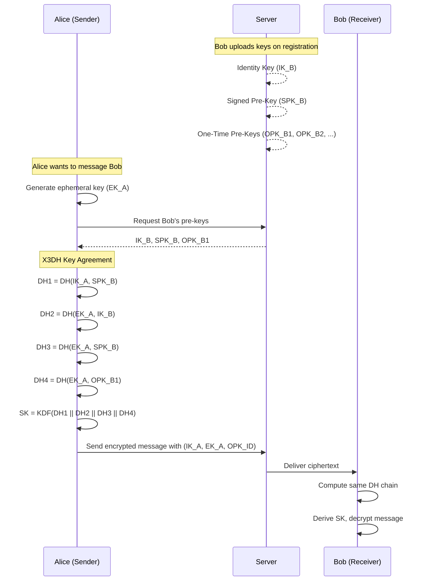
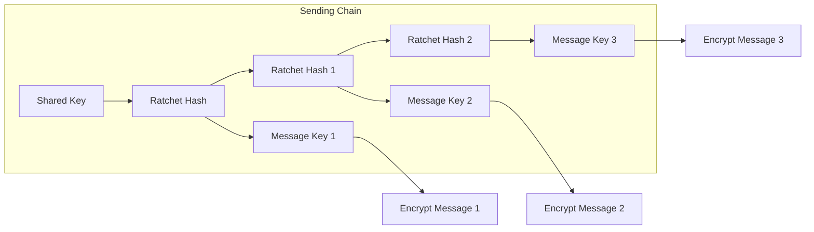
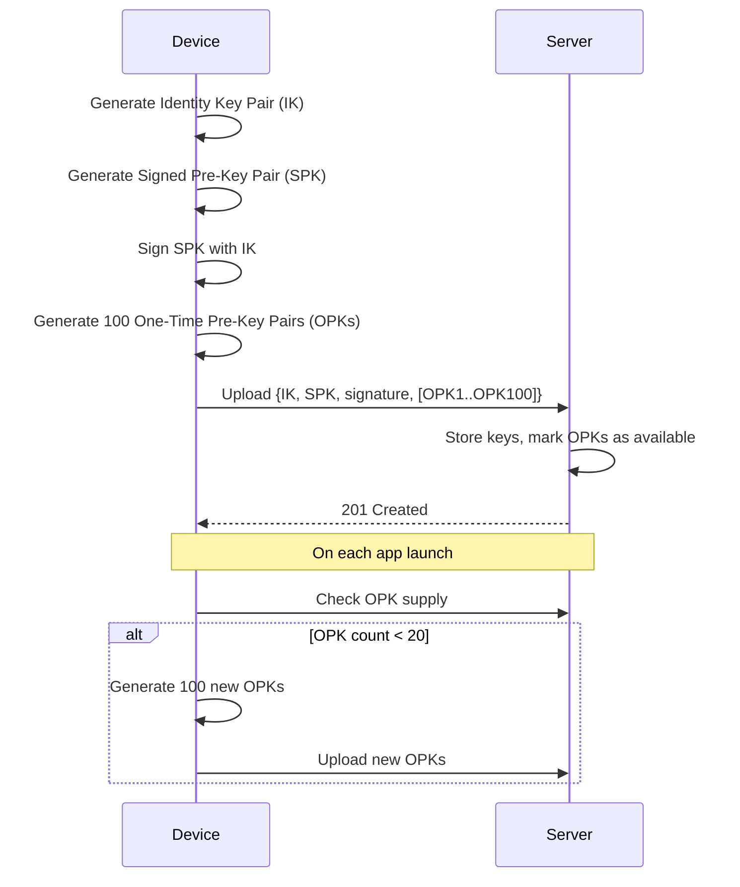
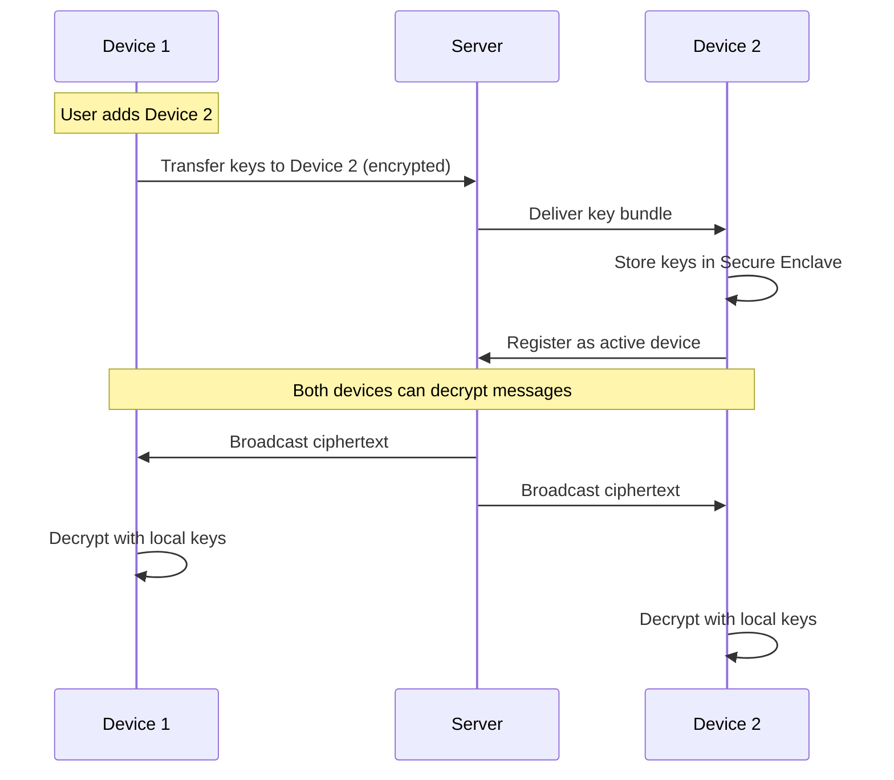

# End-to-End Encryption

> **NOTE:** Full end-to-end encryption using Signal Protocol is planned but not yet implemented. Current implementation uses server-side password hashing (bcrypt) and HTTPS transport encryption.

## OJChat — E2EE Architecture & Signal Protocol Implementation

**Version:** 1.0.0
**Date:** July 2026

---

## 1. Encryption Overview

OJChat implements **Signal Protocol** for end-to-end encryption of all messages, voice notes, and media. The server acts as a key relay and ciphertext store — it never has access to plaintext content.

### 1.1 Security Guarantees

| Property | Guarantee |
|---|---|
| Confidentiality | Only sender and recipient can read messages |
| Integrity | Messages cannot be tampered with in transit |
| Forward Secrecy | Compromise of long-term keys doesn't expose past messages |
| Future Secrecy | Compromise of current session doesn't expose future messages |
| Deniability | Messages are authenticated but not non-repudiable |
| No Server Access | Server stores only encrypted ciphertext |

---

## 2. Signal Protocol Components

### 2.1 X3DH (Extended Triple Diffie-Hellman)

Used for initial key exchange when two users establish a conversation for the first time.



### 2.2 Double Ratchet Algorithm

Used for ongoing message encryption after session establishment. Each message uses a new encryption key derived from the ratchet.



---

## 3. Key Types & Lifecycle

### 3.1 Key Hierarchy

| Key Type | Purpose | Lifetime | Storage |
|---|---|---|---|
| Identity Key (IK) | Long-term device identity | Until device removal | Secure enclave |
| Signed Pre-Key (SPK) | Medium-term, signed by IK | 7 days (rotated) | Secure enclave |
| One-Time Pre-Keys (OPK) | Single-use, consumed in X3DH | Until consumed | Secure enclave |
| Session Key (SK) | Per-conversation encryption | Ratcheted forward | Memory only |
| Message Key (MK) | Per-message encryption | Ephemeral (used once) | Memory only |

### 3.2 Key Registration Flow



---

## 4. Encryption Implementation

### 4.1 libsignal Integration

```typescript
// src/crypto/signal-protocol.ts
import {
  KeyHelper,
  KeyPairType,
  SignedPublicPreKeyWhisperMessage,
  PreKeyWhisperMessage,
} from '@signalapp/libsignal-client';
import { SignalProtocolStore } from './store';

export class SignalProtocol {
  private store: SignalProtocolStore;

  constructor(store: SignalProtocolStore) {
    this.store = store;
  }

  async generateIdentityKeyPair(): Promise<KeyPairType> {
    const identityKeyPair = await KeyHelper.generateIdentityKeyPair();
    await this.store.saveIdentityKeyPair(identityKeyPair);
    return identityKeyPair;
  }

  async generateSignedPreKey(
    identityKeyPair: KeyPairType
  ): Promise<{ keyId: number; keyPair: KeyPairType; signature: ArrayBuffer }> {
    const keyId = await this.store.getNextSignedPreKeyId();
    const keyPair = await KeyHelper.generateSignedKeyPair(
      identityKeyPair,
      keyId
    );
    await this.store.saveSignedPreKey(keyId, keyPair);
    return { keyId, keyPair, signature: keyPair.signature };
  }

  async generateOneTimePreKeys(
    count: number
  ): Promise<Array<{ keyId: number; keyPair: KeyPairType }>> {
    const startId = await this.store.getNextOneTimePreKeyId();
    const keys = [];

    for (let i = 0; i < count; i++) {
      const keyId = startId + i;
      const keyPair = await KeyHelper.generatePreKey(keyId);
      await this.store.saveOneTimePreKey(keyId, keyPair);
      keys.push({ keyId, keyPair });
    }

    return keys;
  }
}
```

### 4.2 Message Encryption

```typescript
// src/crypto/encrypt.ts
import {
  SignalProtocolAddress,
  SessionBuilder,
  SessionCipher,
} from '@signalapp/libsignal-client';

export class MessageEncryptor {
  private store: SignalProtocolStore;

  async encryptMessage(
    recipientId: string,
    deviceId: number,
    plaintext: string
  ): Promise<EncryptedMessage> {
    const address = new SignalProtocolAddress(recipientId, deviceId);

    // Build session if not exists
    const sessionBuilder = new SessionBuilder(this.store, address);
    await sessionBuilder.processPreKey(/* pre-key bundle */);

    // Encrypt message
    const cipher = new SessionCipher(this.store, address);
    const ciphertext = await cipher.encrypt(
      Buffer.from(plaintext, 'utf-8')
    );

    return {
      type: ciphertext.type,
      body: ciphertext.body,
      timestamp: Date.now(),
    };
  }

  async decryptMessage(
    senderId: string,
    deviceId: number,
    ciphertext: EncryptedMessage
  ): Promise<string> {
    const address = new SignalProtocolAddress(senderId, deviceId);
    const cipher = new SessionCipher(this.store, address);

    const plaintext = await cipher.decryptWhisperMessage(
      ciphertext.body,
      'binary'
    );

    return Buffer.from(plaintext).toString('utf-8');
  }
}
```

### 4.3 Media Encryption

```typescript
// src/crypto/media-encrypt.ts
import CryptoJS from 'crypto-js';

export class MediaEncryptor {
  async encryptFile(fileUri: string): Promise<EncryptedFile> {
    // Generate random AES-256 key
    const fileKey = CryptoJS.lib.WordArray.random(32);
    const iv = CryptoJS.lib.WordArray.random(16);

    // Read file
    const fileData = await RNFS.readFile(fileUri, 'base64');

    // Encrypt with AES-256-CBC
    const encrypted = CryptoJS.AES.encrypt(fileData, fileKey, {
      iv: iv,
      mode: CryptoJS.mode.CBC,
      padding: CryptoJS.pad.Pkcs7,
    });

    // Write encrypted file
    const encryptedUri = `${fileUri}.encrypted`;
    await RNFS.writeFile(encryptedUri, encrypted.toString(), 'utf8');

    return {
      uri: encryptedUri,
      key: fileKey.toString(), // encrypted with user's key before upload
      iv: iv.toString(),
      mimeType: 'application/octet-stream',
    };
  }

  async decryptFile(
    encryptedUri: string,
    key: string,
    iv: string
  ): Promise<string> {
    const encryptedData = await RNFS.readFile(encryptedUri, 'utf8');

    const decrypted = CryptoJS.AES.decrypt(encryptedData, key, {
      iv: CryptoJS.enc.Hex.parse(iv),
      mode: CryptoJS.mode.CBC,
      padding: CryptoJS.pad.Pkcs7,
    });

    const decryptedUri = encryptedUri.replace('.encrypted', '.decrypted');
    await RNFS.writeFile(
      decryptedUri,
      decrypted.toString(CryptoJS.enc.Base64),
      'base64'
    );

    return decryptedUri;
  }
}
```

---

## 5. Key Management

### 5.1 Secure Storage

```typescript
// src/security/keychain.ts
import * as Keychain from 'react-native-keychain';

const SERVICE_NAME = 'com.ojchat.crypto';

export async function storeKey(
  keyAlias: string,
  keyData: ArrayBuffer
): Promise<void> {
  await Keychain.setGenericPassword(
    keyAlias,
    Buffer.from(keyData).toString('base64'),
    {
      service: `${SERVICE_NAME}.${keyAlias}`,
      accessible: Keychain.ACCESSIBLE.WHEN_UNLOCKED_THIS_DEVICE_ONLY,
      securityLevel: Keychain.SECURITY_LEVEL.SECURE_HARDWARE,
    }
  );
}

export async function retrieveKey(
  keyAlias: string
): Promise<ArrayBuffer | null> {
  const credentials = await Keychain.getGenericPassword({
    service: `${SERVICE_NAME}.${keyAlias}`,
  });

  if (!credentials) return null;

  return Buffer.from(credentials.password, 'base64');
}

export async function deleteKey(keyAlias: string): Promise<void> {
  await Keychain.resetGenericPassword({
    service: `${SERVICE_NAME}.${keyAlias}`,
  });
}
```

### 5.2 Key Rotation

| Key | Rotation Period | Trigger |
|---|---|---|
| Signed Pre-Key | Every 7 days | Background job |
| One-Time Pre-Keys | When count < 20 | App launch check |
| Identity Key | Never (device lifetime) | Manual re-registration only |
| Session Key | Every message | Double Ratchet (automatic) |

---

## 6. Multi-Device Management



---

## 7. Secure Backup

```typescript
// src/crypto/backup.ts
export class SecureBackup {
  async backupKeys(masterPassword: string): Promise<BackupData> {
    // Derive backup key from master password
    const backupKey = await this.deriveBackupKey(masterPassword);

    // Export all identity keys
    const keys = await this.store.exportAllKeys();

    // Encrypt key bundle with backup key
    const encryptedBundle = CryptoJS.AES.encrypt(
      JSON.stringify(keys),
      backupKey
    );

    // Upload to server (server cannot decrypt without password)
    return {
      encryptedBundle: encryptedBundle.toString(),
      salt: backupKey.salt,
      iterations: backupKey.iterations,
    };
  }

  async restoreKeys(
    backupData: BackupData,
    masterPassword: string
  ): Promise<void> {
    const backupKey = await this.deriveBackupKey(
      masterPassword,
      backupData.salt,
      backupData.iterations
    );

    const decrypted = CryptoJS.AES.decrypt(
      backupData.encryptedBundle,
      backupKey
    );

    const keys = JSON.parse(decrypted.toString(CryptoJS.enc.Utf8));
    await this.store.importAllKeys(keys);
  }

  private async deriveBackupKey(
    password: string,
    salt?: string,
    iterations?: number
  ): Promise<DerivedKey> {
    const actualSalt = salt || crypto.randomBytes(32).toString('hex');
    const actualIterations = iterations || 600000;

    const key = crypto.pbkdf2Sync(
      password,
      actualSalt,
      actualIterations,
      32,
      'sha512'
    );

    return { key, salt: actualSalt, iterations: actualIterations };
  }
}
```

---

## 8. Server's Role

The server is a **trusted relay** — it stores and delivers ciphertext but cannot read content.

| Server Can | Server Cannot |
|---|---|
| Store encrypted ciphertext | Read message content |
| Relay key bundles | Decrypt messages |
| Deliver encrypted messages | Access encryption keys |
| Track metadata (timing, size) | Link sender to recipient (with pseudonymous IDs) |
| Manage key distribution | Forge messages |

---

## 9. Threat Model

| Threat | Mitigation |
|---|---|
| Server compromise | Ciphertext only — no plaintext accessible |
| Man-in-the-middle | X3DH with identity key verification |
| Key compromise | Forward secrecy via Double Ratchet |
| Device theft | Secure enclave storage, biometric lock |
| Replay attacks | Message keys used once, ratcheted forward |
| Metadata leakage | Minimize metadata retention, pseudonymous IDs |
| Backup compromise | User-controlled backup encryption |

---

## 10. Comparison with Other Platforms

| Feature | OJChat | Signal | WhatsApp | iMessage |
|---|---|---|---|---|
| Protocol | Signal Protocol | Signal Protocol | Signal Protocol | Custom |
| Forward Secrecy | Yes | Yes | Yes | Yes |
| Future Secrecy | Yes | Yes | Yes | Yes |
| Group E2EE | Phase 2 | Yes | Yes | Yes |
| Metadata Protection | Partial | Partial | No | No |
| Open Source | No | Yes | No | No |
| Server Access | Ciphertext only | Ciphertext only | Ciphertext only | Ciphertext only |

---

*This document is part of the OJChat Software Design Document (SDD) package.*
