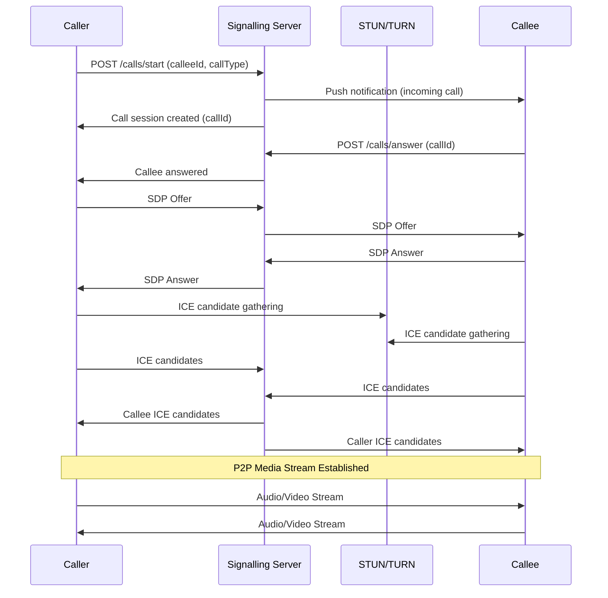

# WebRTC Voice & Video

## Connecta — WebRTC Call Architecture

**Version:** 1.0.0
**Date:** July 2026

---

## 1. Architecture Overview

Connecta uses **WebRTC** for peer-to-peer voice and video calls. The system includes a signalling server for call setup, STUN/TURN servers for NAT traversal, and optional SFU (Selective Forwarding Unit) for future group calls.

### 1.1 Call Flow Overview



---

## 2. STUN/TURN Server Setup

### 2.1 Coturn Configuration

```ini
# /etc/turnserver.conf
listening-port=3478
tls-listening-port=5349

# Authentication
realm=connecta.app
lt-cred-mech
user=connecta:TURN_SECRET_KEY

# Certificates
cert=/etc/ssl/certs/turn.pem
pkey=/etc/ssl/private/turn.key

# Relay
relay-ip=PUBLIC_IP
external-ip=PUBLIC_IP/PRIVATE_IP

# Security
no-multicast-peers
no-cli
no-tlsv1
no-tlsv1_1

# Performance
total-quota=100
stale-nonce=600
proc-user=turnserver
proc-group=turnserver
```

### 2.2 ICE Server Configuration

```typescript
// src/webrtc/ice-config.ts
export const ICE_SERVERS: RTCIceServer[] = [
  { urls: 'stun:stun.connecta.app:3478' },
  { urls: 'stun:stun.l.google.com:19302' },
  {
    urls: [
      'turn:turn.connecta.app:3478?transport=udp',
      'turn:turn.connecta.app:3478?transport=tcp',
      'turns:turn.connecta.app:5349?transport=tcp',
    ],
    username: 'connecta',
    credential: TURN_CREDENTIAL,
  },
];
```

---

## 3. Signalling Server

### 3.1 Call Signalling Endpoints

```typescript
// apps/call-signalling-service/src/

@Controller('calls')
export class CallController {
  @Post('start')
  @UseGuards(JwtAuthGuard)
  async startCall(@Body() dto: StartCallDto) {
    const session = await this.callService.startCall(dto);
    return { callId: session.id, status: 'ringing' };
  }

  @Post('answer')
  @UseGuards(JwtAuthGuard)
  async answerCall(@Body() dto: AnswerCallDto) {
    await this.callService.answerCall(dto);
    return { status: 'connected' };
  }

  @Post('reject')
  @UseGuards(JwtAuthGuard)
  async rejectCall(@Body() dto: RejectCallDto) {
    await this.callService.rejectCall(dto);
    return { status: 'rejected' };
  }

  @Post('end')
  @UseGuards(JwtAuthGuard)
  async endCall(@Body() dto: EndCallDto) {
    await this.callService.endCall(dto);
    return { status: 'ended' };
  }

  @Get('history')
  @UseGuards(JwtAuthGuard)
  async getCallHistory(@Req() req, @Query() query: CallHistoryDto) {
    return this.callService.getHistory(req.user.id, query);
  }
}
```

### 3.2 WebSocket Events

```typescript
// Socket.IO events for call signalling
export const CALL_EVENTS = {
  // Client → Server
  CALL_START: 'call:start',
  CALL_ANSWER: 'call:answer',
  CALL_REJECT: 'call:reject',
  CALL_END: 'call:end',
  ICE_CANDIDATE: 'call:ice-candidate',
  SDP_OFFER: 'call:sdp-offer',
  SDP_ANSWER: 'call:sdp-answer',
  CALL_QUALITY: 'call:quality-report',

  // Server → Client
  CALL_INCOMING: 'call:incoming',
  CALL_CONNECTED: 'call:connected',
  CALL_REJECTED: 'call:rejected',
  CALL_ENDED: 'call:ended',
  ICE_CANDIDATE_RECEIVED: 'call:ice-candidate-received',
  SDP_OFFER_RECEIVED: 'call:sdp-offer-received',
  SDP_ANSWER_RECEIVED: 'call:sdp-answer-received',
  CALL_RECONNECTING: 'call:reconnecting',
  CALL_QUALITY_UPDATE: 'call:quality-update',
};
```

---

## 4. WebRTC Client Implementation

```typescript
// src/webrtc/peer-connection.ts
import RTCPeerConnection from 'react-native-webrtc';

export class PeerConnectionManager {
  private peerConnection: RTCPeerConnection;
  private localStream: MediaStream;
  private remoteStream: MediaStream;

  constructor(private config: RTCConfiguration) {
    this.peerConnection = new RTCPeerConnection(config);
    this.setupEventHandlers();
  }

  private setupEventHandlers(): void {
    this.peerConnection.onicecandidate = (event) => {
      if (event.candidate) {
        this.onIceCandidate(event.candidate);
      }
    };

    this.peerConnection.ontrack = (event) => {
      this.remoteStream = event.streams[0];
      this.onRemoteStream(this.remoteStream);
    };

    this.peerConnection.oniceconnectionstatechange = () => {
      const state = this.peerConnection.iceConnectionState;
      if (state === 'failed') {
        this.handleConnectionFailure();
      }
    };
  }

  async startCall(callType: 'voice' | 'video'): Promise<void> {
    const constraints: MediaStreamConstraints = {
      audio: true,
      video: callType === 'video' ? { facingMode: 'user', width: 640, height: 480 } : false,
    };

    this.localStream = await navigator.mediaDevices.getUserMedia(constraints);
    this.localStream.getTracks().forEach((track) => {
      this.peerConnection.addTrack(track, this.localStream);
    });

    const offer = await this.peerConnection.createOffer();
    await this.peerConnection.setLocalDescription(offer);
    this.onOfferCreated(offer);
  }

  async handleOffer(sdp: RTCSessionDescription): Promise<void> {
    await this.peerConnection.setRemoteDescription(sdp);
    const answer = await this.peerConnection.createAnswer();
    await this.peerConnection.setLocalDescription(answer);
    this.onAnswerCreated(answer);
  }

  async handleAnswer(sdp: RTCSessionDescription): Promise<void> {
    await this.peerConnection.setRemoteDescription(sdp);
  }

  async addIceCandidate(candidate: RTCIceCandidate): Promise<void> {
    await this.peerConnection.addIceCandidate(candidate);
  }

  toggleMute(): boolean {
    const audioTrack = this.localStream.getAudioTracks()[0];
    audioTrack.enabled = !audioTrack.enabled;
    return audioTrack.enabled;
  }

  toggleVideo(): boolean {
    const videoTrack = this.localStream.getVideoTracks()[0];
    if (videoTrack) {
      videoTrack.enabled = !videoTrack.enabled;
      return videoTrack.enabled;
    }
    return false;
  }

  async switchCamera(): Promise<void> {
    const videoTrack = this.localStream.getVideoTracks()[0];
    // eslint-disable-next-line @typescript-eslint/no-var-requires
    const controls = require('react-native-webrtc').mediaDevices;
    await controls.switchCamera();
  }

  hangup(): void {
    this.localStream.getTracks().forEach((track) => track.stop());
    this.peerConnection.close();
  }

  private handleConnectionFailure(): void {
    // Attempt ICE restart
    this.peerConnection.restartIce();
  }

  onIceCandidate: (candidate: RTCIceCandidate) => void = () => {};
  onRemoteStream: (stream: MediaStream) => void = () => {};
  onOfferCreated: (offer: RTCSessionDescription) => void = () => {};
  onAnswerCreated: (answer: RTCSessionDescription) => void = () => {};
}
```

---

## 5. Push Wake-Up for Incoming Calls

```typescript
// src/webrtc/call-notification.ts
import messaging from '@react-native-firebase/messaging';

export class CallNotificationHandler {
  async setupCallListener(): Promise<void> {
    messaging().onMessage(async (remoteMessage) => {
      if (remoteMessage.data?.type === 'incoming_call') {
        await this.showIncomingCallScreen(remoteMessage.data);
      }
    });

    messaging().setBackgroundMessageHandler(async (remoteMessage) => {
      if (remoteMessage.data?.type === 'incoming_call') {
        await this.handleBackgroundCall(remoteMessage.data);
      }
    });
  }

  private async showIncomingCallScreen(data: CallData): Promise<void> {
    // Show full-screen incoming call UI
    NavigationService.navigate('IncomingCall', {
      callId: data.callId,
      callerName: data.callerName,
      callerPhoto: data.callerPhoto,
      callType: data.callType,
    });
  }
}
```

---

## 6. Call Quality Adaptation

```typescript
// src/webrtc/quality-monitor.ts
export class CallQualityMonitor {
  private statsInterval: NodeJS.Timeout;

  startMonitoring(peerConnection: RTCPeerConnection): void {
    this.statsInterval = setInterval(async () => {
      const stats = await peerConnection.getStats();

      stats.forEach((report) => {
        if (report.type === 'inbound-rtp') {
          const bitrate = report.bytesReceived / report.timestamp;
          const packetLoss = report.packetsLost / report.packetsReceived;

          if (packetLoss > 0.05) {
            this.downgradeQuality(peerConnection);
          } else if (packetLoss < 0.01) {
            this.upgradeQuality(peerConnection);
          }
        }
      });
    }, 5000);
  }

  private downgradeQuality(pc: RTCPeerConnection): void {
    // Reduce video resolution
    const videoTrack = pc.getSenders().find((s) => s.track?.kind === 'video');
    if (videoTrack) {
      const params = videoTrack.getParameters();
      params.encodings[0].maxBitrate = 150000; // 150kbps
      videoTrack.setParameters(params);
    }
  }

  stopMonitoring(): void {
    clearInterval(this.statsInterval);
  }
}
```

---

## 7. Call History

```typescript
// apps/call-signalling-service/src/call.service.ts
@Injectable()
export class CallService {
  async startCall(dto: StartCallDto): Promise<CallSession> {
    const session = this.callRepo.create({
      callerId: dto.callerId,
      calleeId: dto.calleeId,
      callType: dto.callType,
      status: 'ringing',
    });

    await this.callRepo.save(session);

    // Notify callee via push notification
    await this.notificationService.sendPush(dto.calleeId, {
      type: 'incoming_call',
      callId: session.id,
      callType: dto.callType,
    });

    return session;
  }

  async endCall(dto: EndCallDto): Promise<void> {
    const session = await this.callRepo.findOne({ where: { id: dto.callId } });
    session.status = 'completed';
    session.endedAt = new Date();
    session.duration = Math.floor(
      (session.endedAt.getTime() - session.connectedAt.getTime()) / 1000
    );
    session.endReason = dto.reason;
    await this.callRepo.save(session);
  }
}
```

---

## 8. Codec Selection

| Codec | Type | Use Case | Bandwidth |
|---|---|---|---|
| VP8 | Video | Default (Android/Web) | 300–1500 kbps |
| H264 | Video | iOS preferred | 300–1500 kbps |
| Opus | Audio | Voice calls | 6–51 kbps |
| G.711 | Audio | Fallback | 64 kbps |

---

## 9. Error Handling

| Error | Recovery |
|---|---|
| ICE connection failed | Restart ICE, re-gather candidates |
| Network interruption | Show reconnecting UI, attempt recovery for 30s |
| Media permission denied | Show settings prompt, graceful fallback |
| Call timeout (30s) | Auto-reject, notify caller |
| Server disconnect | Reconnect via WebSocket, resume signalling |
| Low bandwidth | Downgrade video to audio-only |

---

*This document is part of the Connecta Software Design Document (SDD) package.*
