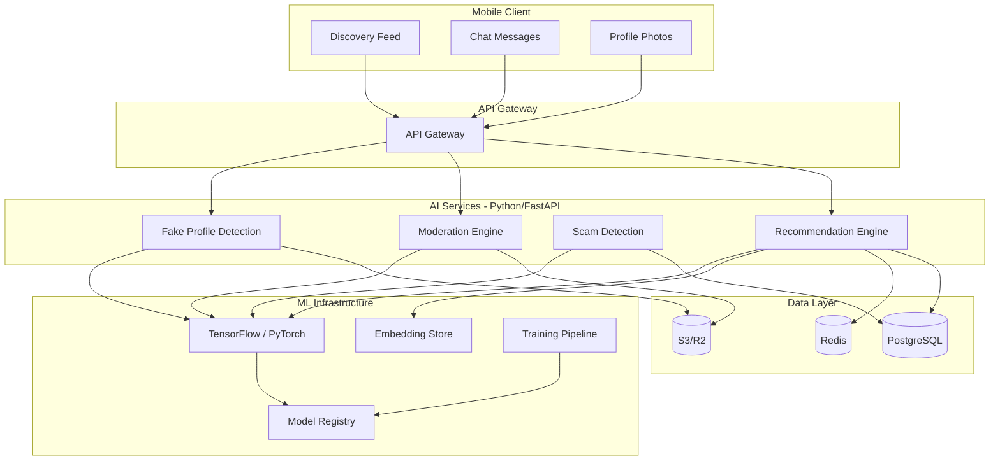
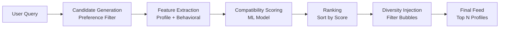
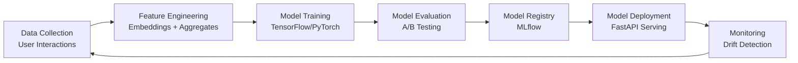

# AI Matchmaking Engine

## OJChat — AI-Powered Compatibility & Safety

**Version:** 1.0.0
**Date:** July 2026

> **Implementation Status (July 2026):**
> - **V1 (Current):** TypeScript/NestJS algorithmic heuristics in `apps/matching-service/src/ai/`
> - **V2 (Planned):** Python/FastAPI sidecar for ML models (when 1,000+ DAU)
> - **V3 (Future):** Full TensorFlow pipeline with training data (when 10,000+ users)
>
> See [Doc 22: AI Matchmaking Audit](22-AI-Matchmaking-Audit.md) for spec-vs-implementation gap analysis.

> **Implementation Note (July 2026):** This spec describes a Python/FastAPI ML-based architecture.
> The current implementation uses TypeScript/NestJS with algorithmic heuristic logic (no ML models).
> See [Doc 22: AI Matchmaking Audit](22-AI-Matchmaking-Audit.md) for the spec-vs-implementation gap
> analysis and known issues.

---

## 1. Architecture Overview

OJChat's AI engine is a set of Python/FastAPI microservices that power matchmaking, safety, and moderation features. The engine uses machine learning models to score compatibility, detect fake profiles, identify scams, and filter toxic content.



---

## 2. Recommendation Engine

### 2.1 Matching Pipeline



### 2.2 Input Signals

| Signal Category | Features | Weight |
|---|---|---|
| **Explicit Preferences** | Age range, distance, education, lifestyle | High |
| **Behavioral** | Swipe patterns, time on profiles, message patterns | High |
| **Engagement** | Response rate, conversation length, app usage | Medium |
| **Social Graph** | Mutual friends, shared interests | Medium |
| **Profile Quality** | Completeness, verification, photo count | Medium |
| **Temporal** | Activity time patterns, online status | Low |

### 2.3 Compatibility Model

```python
# recommendation_engine/models/compatibility.py
import tensorflow as tf
from sentence_transformers import SentenceTransformer

class CompatibilityModel:
    def __init__(self):
        self.text_encoder = SentenceTransformer('all-MiniLM-L6-v2')
        self.model = self._build_model()

    def _build_model(self):
        user_input = tf.keras.Input(shape=(128,), name='user_features')
        candidate_input = tf.keras.Input(shape=(128,), name='candidate_features')
        preference_input = tf.keras.Input(shape=(32,), name='preference_features')

        # Concatenate and process
        concat = tf.keras.layers.Concatenate()([user_input, candidate_input, preference_input])
        dense1 = tf.keras.layers.Dense(256, activation='relu')(concat)
        dense2 = tf.keras.layers.Dense(128, activation='relu')(dense1)
        dense3 = tf.keras.layers.Dense(64, activation='relu')(dense2)
        output = tf.keras.layers.Dense(1, activation='sigmoid', name='compatibility_score')(dense3)

        model = tf.keras.Model(inputs=[user_input, candidate_input, preference_input], outputs=output)
        model.compile(optimizer='adam', loss='binary_crossentropy', metrics=['AUC'])
        return model

    def predict(self, user, candidate, preferences):
        user_emb = self._encode_user(user)
        cand_emb = self._encode_user(candidate)
        pref_emb = self._encode_preferences(preferences)
        score = self.model.predict([user_emb, cand_emb, pref_emb])
        return float(score[0][0])
```

### 2.4 Candidate Generation

```python
# recommendation_engine/services/candidate_generator.py
class CandidateGenerator:
    def generate(self, user_id: str, limit: int = 200) -> list[str]:
        # Step 1: Basic preference filter
        candidates = self.db.query("""
            SELECT p.user_id
            FROM profiles p
            JOIN user_preferences pref ON pref.user_id = :user_id
            WHERE p.user_id != :user_id
              AND p.is_visible = TRUE
              AND p.is_paused = FALSE
              AND p.date_of_birth BETWEEN :age_min AND :age_max
              AND ST_Distance(
                    ST_MakePoint(p.longitude, p.latitude)::geography,
                    ST_MakePoint(:lon, :lat)::geography
              ) <= :distance_max
              AND p.gender = :show_me
              AND p.user_id NOT IN (SELECT blocked_id FROM blocks WHERE blocker_id = :user_id)
              AND p.user_id NOT IN (SELECT liked_user_id FROM likes WHERE user_id = :user_id)
              AND p.user_id NOT IN (SELECT passed_user_id FROM passes WHERE user_id = :user_id)
            ORDER BY p.profile_score DESC
            LIMIT :limit
        """, {
            'user_id': user_id,
            'age_min': user_prefs.age_min,
            'age_max': user_prefs.age_max,
            'lat': user.latitude,
            'lon': user.longitude,
            'distance_max': user_prefs.distance_max_km,
            'show_me': user_prefs.show_me,
            'limit': limit,
        })

        return [r['user_id'] for r in candidates]
```

### 2.5 V1 Compatibility Scoring Algorithm

The current V1 implementation uses a weighted heuristic scoring algorithm in TypeScript. Each dimension is scored 0.0–1.0, then combined using configurable weights.

#### Scoring Dimensions

| Dimension | Weight | Calculation |
|---|---|---|
| **Interest Overlap** | 0.25 | Jaccard similarity: `intersection / union` of interest sets |
| **Lifestyle Compatibility** | 0.20 | School match (+0.15), city match (+0.10), job title match (+0.10/+0.05), prompt text overlap |
| **Values Alignment** | 0.30 | Verified status (+0.10), profile completeness (+0.10), shared value keywords from prompt answers |
| **Communication Style** | 0.15 | Bio length ratio, prompt count similarity |
| **Goal Alignment** | 0.10 | Exact match (+0.30), compatible goals (+0.15) |

#### Dimension Details

**Interest Overlap (0.25)**
Jaccard similarity coefficient computed on the union of user-declared interests and bio-extracted topics:
```
score = |interests_a ∩ interests_b| / |interests_a ∪ interests_b|
```
Returns 0.5 (neutral) when either user has no interests.

**Lifestyle Compatibility (0.20)**
Composite of lifestyle attribute matches:
- Same school/university → +0.15
- Same city → +0.10
- Same job title → +0.10 (exact), +0.05 (partial/fuzzy)
- Prompt answer text overlap (cosine similarity on TF-IDF vectors)

**Values Alignment (0.30)**
- Phone/email verified → +0.10
- Profile completeness percentage → +0.10
- Shared value keywords extracted from prompt Q&A responses (e.g., "honesty", "family", "ambition")

**Communication Style (0.15)**
- Bio length ratio (shorter/longer, capped at 1.0)
- Prompt count difference (fewer prompts = more casual)

**Goal Alignment (0.10)**
- Exact relationship goal match → +0.30
- Compatible goal categories (e.g., "long-term" ↔ "marriage") → +0.15

#### Final Score
```
total = Σ(dimension_score × weight)
```
Weights sum to 1.0. Score range: 0.0 (no compatibility) to 1.0 (perfect compatibility).

```python
# recommendation_engine/services/diversity.py
class DiversityInjector:
    def inject_diversity(self, ranked_profiles: list, diversity_factor: float = 0.3) -> list:
        """Ensure variety in presented matches to avoid filter bubbles."""
        diverse = []
        seen_education = set()
        seen_interests = set()

        for profile in ranked_profiles:
            if len(diverse) >= 20:
                break

            # Score diversity bonus
            education = profile.get('education', '')
            interests = set(profile.get('interests', []))

            diversity_score = 0
            if education not in seen_education:
                diversity_score += 0.5
                seen_education.add(education)

            overlap = len(interests & seen_interests)
            if overlap < 2:
                diversity_score += 0.5
                seen_interests |= interests

            # Combine compatibility and diversity
            final_score = (
                (1 - diversity_factor) * profile['compatibility_score']
                + diversity_factor * diversity_score
            )
            profile['final_score'] = final_score
            diverse.append(profile)

        return sorted(diverse, key=lambda x: x['final_score'], reverse=True)
```

---

## 3. Fake Profile Detection

### 3.1 Detection Signals

| Signal | Method | Confidence |
|---|---|---|
| Photo analysis | Reverse image search, AI detection | High |
| Profile completeness | Missing fields scoring | Medium |
| Behavioral patterns | Bot-like activity, mass messaging | High |
| Account age | New accounts with suspicious activity | Medium |
| Phone verification | Unverified numbers flagged | Low |
| Device fingerprint | Multiple accounts on same device | High |

### 3.2 Photo Analysis

```python
# moderation_engine/services/photo_analyzer.py
import cv2
import numpy as np
from deepface import DeepFace

class PhotoAnalyzer:
    def analyze_photo(self, image_url: str) -> dict:
        results = {
            'is_ai_generated': False,
            'is_stock_photo': False,
            'is_face_swapped': False,
            'face_count': 0,
            'confidence': 0.0,
            'flags': [],
        }

        img = cv2.imread(image_url)

        # Check for AI-generated images
        ai_score = self._detect_ai_generation(img)
        results['is_ai_generated'] = ai_score > 0.8
        if results['is_ai_generated']:
            results['flags'].append('ai_generated')

        # Check for stock photos (reverse image search)
        stock_score = self._reverse_image_search(image_url)
        results['is_stock_photo'] = stock_score > 0.7
        if results['is_stock_photo']:
            results['flags'].append('stock_photo')

        # Face detection
        faces = DeepFace.extract_faces(img, enforce_detection=False)
        results['face_count'] = len(faces)

        if results['face_count'] == 0:
            results['flags'].append('no_face_detected')

        # Age-gender consistency
        try:
            analysis = DeepFace.analyze(img, actions=['age', 'gender'], enforce_detection=False)
            results['detected_age'] = analysis['age']
            results['detected_gender'] = analysis['gender']
        except Exception:
            pass

        results['confidence'] = 1.0 - (len(results['flags']) * 0.2)
        return results

    def _detect_ai_generation(self, img) -> float:
        """Detect AI-generated images using frequency analysis."""
        gray = cv2.cvtColor(img, cv2.COLOR_BGR2GRAY)
        f_transform = np.fft.fft2(gray)
        f_shift = np.fft.fftshift(f_transform)
        magnitude = np.log(np.abs(f_shift) + 1)
        # AI images often have unnatural frequency patterns
        return float(np.mean(magnitude > np.percentile(magnitude, 95)))
```

### 3.3 Behavioral Analysis

```python
# moderation_engine/services/behavior_analyzer.py
class BehaviorAnalyzer:
    def analyze_user(self, user_id: str) -> dict:
        stats = self.db.query_user_stats(user_id)

        flags = []
        risk_score = 0.0

        # Mass messaging detection
        if stats['messages_sent_24h'] > 200:
            flags.append('mass_messaging')
            risk_score += 0.4

        # Like-spam detection
        if stats['likes_given_24h'] > 100:
            flags.append('like_spam')
            risk_score += 0.3

        # Profile view to match ratio
        if stats['profile_views'] > 0:
            match_rate = stats['matches'] / stats['profile_views']
            if match_rate > 0.9:  # Almost everyone they view matches
                flags.append('suspicious_match_rate')
                risk_score += 0.2

        # Account age vs activity
        account_age_days = stats['account_age_days']
        if account_age_days < 1 and stats['total_messages'] > 50:
            flags.append('new_account_high_activity')
            risk_score += 0.3

        return {
            'risk_score': min(risk_score, 1.0),
            'flags': flags,
            'is_suspicious': risk_score > 0.5,
        }
```

---

## 4. Romance Scam Detection

### 4.1 Scam Indicators

| Pattern | Description | Weight |
|---|---|---|
| Money requests | Mentions of sending money, financial help | Very High |
| Rapid escalation | "I love you" within first 5 messages | High |
| Sob stories | Family emergencies, travel problems | High |
| External links | Links to other platforms, crypto sites | High |
| Profile inconsistency | Bio doesn't match conversation | Medium |
| Refusal to meet | Always has excuses to avoid video/meetup | Medium |
| Generic messages | Copy-paste style messaging | Low |

### 4.2 Conversation Analysis

```python
# scam_detection/services/conversation_analyzer.py
import re
from transformers import pipeline

class ScamDetector:
    def __init__(self):
        self.nlp = pipeline('text-classification', model='finiteautomata/bertweet-base-sentiment-analysis')
        self.money_patterns = [
            r'send\s+money', r'wire\s+transfer', r'western\s+union',
            r'bitcoin', r'crypto', r'invest', r'opportunity',
            r'bank\s+account', r'swift\s+code', r'gift\s+card',
        ]

    def analyze_conversation(self, messages: list) -> dict:
        risk_score = 0.0
        flags = []

        text = ' '.join([m['content'] for m in messages if m['content']])

        # Money request detection
        for pattern in self.money_patterns:
            if re.search(pattern, text, re.IGNORECASE):
                flags.append(f'money_mention: {pattern}')
                risk_score += 0.3
                break

        # Rapid escalation detection
        if len(messages) < 10:
            love_words = ['love', 'soulmate', 'destiny', 'meant to be', 'marry']
            love_count = sum(1 for w in love_words if w in text.lower())
            if love_count > 2:
                flags.append('rapid_emotional_escalation')
                risk_score += 0.4

        # Sob story detection
        sob_words = ['emergency', 'hospital', 'accident', 'stuck', 'stranded', 'need help']
        sob_count = sum(1 for w in sob_words if w in text.lower())
        if sob_count > 1:
            flags.append('sob_story_pattern')
            risk_score += 0.3

        # External link detection
        urls = re.findall(r'https?://[^\s]+', text)
        if urls:
            flags.append(f'external_links: {len(urls)}')
            risk_score += 0.2

        return {
            'risk_score': min(risk_score, 1.0),
            'flags': flags,
            'is_scam_suspected': risk_score > 0.5,
        }
```

---

## 5. Toxic Language Detection

### 5.1 On-Device Detection

```typescript
// src/ai/toxicity-detector.ts
import { bundleResourceFile, decode } from '@tensorflow/tfjs-react-native';

export class OnDeviceToxicityDetector {
  private model: tf.LayersModel;
  private labels = ['toxic', 'severe_toxic', 'obscene', 'threat', 'insult', 'identity_hate'];

  async initialize(): Promise<void> {
    const modelJson = require('../../assets/models/toxicity/model.json');
    const modelWeights = require('../../assets/models/toxicity/weights.bin');
    this.model = await bundleResourceFile(modelJson, modelWeights);
  }

  async detect(text: string): Promise<ToxicityResult> {
    const tokens = this.tokenize(text);
    const input = tf.tensor2d([tokens]);
    const prediction = this.model.predict(input) as tf.Tensor;
    const scores = await prediction.data();

    const results: Record<string, number> = {};
    this.labels.forEach((label, i) => {
      results[label] = scores[i];
    });

    return {
      isToxic: results['toxic'] > 0.8,
      scores: results,
      categories: this.labels.filter((l) => results[l] > 0.8),
    };
  }
}
```

### 5.2 Server-Side Moderation

```python
# moderation_engine/services/toxicity.py
from detoxify import Detoxify

class ToxicityDetector:
    def __init__(self):
        self.model = Detoxify('multilingual')

    def check_message(self, text: str) -> dict:
        results = self.model.predict(text)

        return {
            'is_toxic': results['toxicity'] > 0.7,
            'scores': {
                'toxicity': results['toxicity'],
                'severe_toxicity': results['severe_toxicity'],
                'obscene': results['obscene'],
                'threat': results['threat'],
                'insult': results['insult'],
                'identity_hate': results['identity_hate'],
            },
            'action': self._determine_action(results),
        }

    def _determine_action(self, results):
        if results['severe_toxicity'] > 0.9:
            return 'block'
        elif results['toxicity'] > 0.7:
            return 'warn'
        return 'allow'
```

---

## 6. AI Ice Breakers

```python
# recommendation_engine/services/ice_breakers.py
from openai import OpenAI

class IceBreakerGenerator:
    def __init__(self):
        self.client = OpenAI(api_key=OPENAI_API_KEY)

    def generate(self, user_profile: dict, match_profile: dict) -> list[str]:
        prompt = f"""
        Generate 5 conversation ice breakers for these two people matching on a dating app.

        User: {user_profile['bio']}, interests: {user_profile['interests']}
        Match: {match_profile['bio']}, interests: {match_profile['interests']}

        Generate natural, witty, and engaging ice breakers that reference shared interests.
        """

        response = self.client.chat.completions.create(
            model="gpt-4o-mini",
            messages=[{"role": "user", "content": prompt}],
            max_tokens=200,
        )

        return response.choices[0].message.content.split('\n')
```

> **Current Implementation:** The V1 implementation uses local template-based icebreaker generation
> with regex bio topic extraction. No OpenAI dependency. See `icebreaker.generator.ts`.

---

## 7. AI Compatibility Score

```python
# recommendation_engine/services/compatibility_score.py
class CompatibilityScorer:
    def score(self, user: dict, candidate: dict) -> dict:
        scores = {
            'interest_overlap': self._interest_score(user, candidate),
            'lifestyle_compatibility': self._lifestyle_score(user, candidate),
            'values_alignment': self._values_score(user, candidate),
            'communication_style': self._communication_score(user, candidate),
            'goal_alignment': self._goal_score(user, candidate),
        }

        weights = {
            'interest_overlap': 0.25,
            'lifestyle_compatibility': 0.20,
            'values_alignment': 0.30,
            'communication_style': 0.15,
            'goal_alignment': 0.10,
        }

        total = sum(scores[k] * weights[k] for k in scores)

        return {
            'total_score': round(total, 2),
            'breakdown': scores,
            'summary': self._generate_summary(scores),
        }

    def _interest_score(self, user, candidate):
        user_interests = set(user.get('interests', []))
        candidate_interests = set(candidate.get('interests', []))
        if not user_interests or not candidate_interests:
            return 0.5
        overlap = len(user_interests & candidate_interests)
        total = len(user_interests | candidate_interests)
        return overlap / total if total > 0 else 0.0
```

---

## 8. Model Training Pipeline



### 8.1 Training Data

| Data Source | Purpose | Privacy |
|---|---|---|
| Swipe patterns | Learn user preferences | Anonymized |
| Match outcomes | Validate compatibility | Anonymized |
| Conversation length | Measure match quality | Aggregated |
| Report flags | Train scam/toxic models | Anonymized |
| Photo verification | Train fake detection | Processed on-device |

---

## 9. Python ML Implementation Roadmap

The current implementation uses TypeScript/NestJS with algorithmic heuristics. This section outlines the planned upgrade to Python/FastAPI with ML models as specified in earlier sections.

### 9.1 Migration Strategy

| Phase | Trigger | Scope | Infrastructure |
|-------|---------|-------|----------------|
| **V1 (Current)** | Now | TypeScript heuristics | NestJS monorepo |
| **V2** | 1,000+ active users | Python sidecar for embeddings + scam NLP | FastAPI + Redis |
| **V3** | 10,000+ users | Full ML pipeline (compatibility, fake detection) | TensorFlow + MLflow |

### 9.2 V2: Python Sidecar Service

When user data is sufficient for training, add a `recommendation-engine/` Python microservice:

```
recommendation-engine/
├── app/
│   ├── main.py                  # FastAPI app
│   ├── models/
│   │   ├── compatibility.py     # TensorFlow compatibility model
│   │   ├── scam_detector.py     # NLP scam classifier
│   │   └── embeddings.py        # Sentence-transformer embeddings
│   ├── services/
│   │   ├── candidate_generator.py
│   │   ├── behavioral_analyzer.py
│   │   └── icebreaker_generator.py
│   └── training/
│       ├── pipeline.py          # Model training pipeline
│       └── data_loader.py       # Training data extraction
├── requirements.txt
├── Dockerfile
└── docker-compose.yml
```

**Key dependencies:**
```
tensorflow>=2.15.0
sentence-transformers>=2.2.0
fastapi>=0.104.0
uvicorn>=0.24.0
redis>=5.0.0
scikit-learn>=1.3.0
```

### 9.3 V3: Full ML Pipeline

When sufficient training data exists:

1. **Data collection** — Anonymized swipe patterns, match outcomes, conversation metrics
2. **Feature engineering** — User embeddings from profile text, behavioral features from interaction logs
3. **Model training** — TensorFlow neural network for compatibility scoring (as specified in Section 2.3)
4. **Evaluation** — A/B testing against heuristic baseline
5. **Deployment** — Model serving via FastAPI with Redis caching
6. **Monitoring** — Model drift detection, retraining triggers

### 9.4 Inter-Service Communication

NestJS gateway communicates with Python sidecar via:
- **HTTP/gRPC** for synchronous scoring requests
- **Redis pub/sub** for async behavioral analysis
- **Shared PostgreSQL** for training data access

### 9.5 Decision Criteria for V2

Proceed with Python sidecar when:
- [ ] 1,000+ daily active users
- [ ] 10,000+ match outcomes collected
- [ ] 50,000+ messages for scam training data
- [ ] Conversion rate metrics established (heuristic baseline)
- [ ] Infrastructure budget approved for Python runtime

---

*This document is part of the OJChat Software Design Document (SDD) package.*
