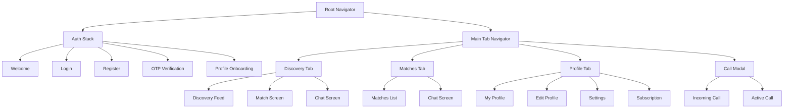

# UI/UX Specification

## OJChat — Screen Specifications & Design System

**Version:** 1.0.0
**Date:** July 2026

---

## 1. Design System

### 1.1 Brand Colors

| Color | Hex | Usage |
|---|---|---|
| Primary (Coral) | `#FF6B6B` | Buttons, accents, likes |
| Primary Dark | `#E85555` | Pressed states |
| Secondary (Purple) | `#7C3AED` | Super likes, premium features |
| Background | `#FFFFFF` | Main background |
| Surface | `#F8F9FA` | Cards, containers |
| Text Primary | `#1A1A2E` | Headings, body text |
| Text Secondary | `#6B7280` | Subtitles, captions |
| Success | `#10B981` | Online status, confirmations |
| Warning | `#F59E0B` | Alerts, pending states |
| Error | `#EF4444` | Errors, destructive actions |
| Border | `#E5E7EB` | Dividers, borders |

### 1.2 Typography

| Element | Font | Size | Weight |
|---|---|---|---|
| H1 | Inter | 28px | Bold |
| H2 | Inter | 24px | SemiBold |
| H3 | Inter | 20px | SemiBold |
| Body | Inter | 16px | Regular |
| Caption | Inter | 14px | Regular |
| Small | Inter | 12px | Regular |
| Button | Inter | 16px | SemiBold |

### 1.3 Spacing

| Token | Value |
|---|---|
| xs | 4px |
| sm | 8px |
| md | 16px |
| lg | 24px |
| xl | 32px |
| xxl | 48px |

### 1.4 Border Radius

| Element | Radius |
|---|---|
| Button | 12px |
| Card | 16px |
| Avatar (small) | 20px |
| Avatar (large) | 40px |
| Input | 10px |
| Bottom Sheet | 24px |

---

## 2. Screen Specifications

### 2.1 Onboarding Screens

#### Splash Screen
- OJChat logo (centered)
- Tagline: "Find Your Connection"
- Loading indicator
- Duration: 2–3 seconds

#### Welcome Screen
- Hero illustration
- "Welcome to OJChat" heading
- "Join millions finding meaningful connections"
- [Get Started] button (primary)
- "Already have an account? Log In" link

#### Phone Verification Screen
- Country code selector (default +234 Nigeria)
- Phone number input
- [Send OTP] button
- OTP input (6 digits, auto-advance)
- [Verify] button
- Resend OTP timer (60s)

#### Profile Creation — Photos
- Photo grid (6 slots, first = primary)
- [Add Photo] button with camera/gallery options
- Drag to reorder
- Long press to delete
- Minimum 1 photo required
- [Next] button

#### Profile Creation — Basic Info
- First name input
- Date of birth picker
- Gender selector (Male, Female, Non-binary)
- Job title input
- Education input
- [Next] button

#### Profile Creation — Bio
- Bio text area (500 char max)
- Character count indicator
- Suggested prompts: "My ideal first date...", "I'm looking for..."
- [Next] button

#### Profile Creation — Interests
- Interest tag grid (multi-select)
- Categories: Sports, Music, Food, Travel, Movies, Books, etc.
- Min 3, Max 10
- [Next] button

#### Profile Creation — Preferences
- Age range slider (18–60)
- Distance slider (1–100 km)
- Show me selector (Men, Women, Everyone)
- [Finish] button

---

### 2.2 Main App Screens

#### Home / Discovery Screen (Main Tab)
- Full-screen profile card (swipeable)
- Profile photo (primary)
- Name, age, distance
- Bio preview
- Interest tags
- Verification badge (if verified)
- Bottom action bar:
  - Red X (Pass) — left
  - Purple Star (Super Like) — center-left
  - Blue Heart (Like) — center-right
  - Gold Lightning (Boost) — right
- Stack of next 3 profiles behind current

#### Match Screen
- "It's a Match!" overlay animation
- Both profile photos (side by side)
- [Send Message] button
- [Keep Swiping] button

#### Matches / Conversations List (Tab)
- Match carousel at top (horizontal scroll of matches with photos)
- Conversation list below (sorted by last message)
- Each row: avatar, name, last message preview, timestamp, unread indicator
- Pull to refresh
- Empty state: "No conversations yet. Start swiping!"

#### Chat Screen
- Header: avatar, name, online status, video call icon
- Message bubbles (sent = right/coral, received = left/gray)
- Text messages
- Image messages (thumbnail, tap to expand)
- Voice notes (waveform, play button, duration)
- Message reactions (emoji)
- Typing indicator
- Read receipts (double check marks)
- Timestamps (today: time only, older: date + time)
- Bottom input bar: text input, attach icon, send button
- Swipe up to see profile

#### Profile Screen (Tab)
- Profile photo (large, tap to edit)
- Edit profile icon
- Name, age, bio
- Photos grid (tap to view full)
- Interest tags
- Verification badge
- Profile completion percentage
- [Edit Profile] button

#### Edit Profile Screen
- Photo management (add, remove, reorder)
- Edit name, bio, job, education
- Edit interests
- Edit lifestyle preferences
- [Save] button

#### Settings Screen
- Account settings
  - Edit phone number
  - Edit email
  - Change password
  - Two-factor authentication
  - Device management
- Discovery settings
  - Age range
  - Distance
  - Show me
- Notification settings
  - Match notifications
  - Message notifications
  - Call notifications
  - Quiet hours
- Privacy settings
  - Block list
  - Data download
  - Account deletion
- Subscription
  - Current plan
  - Manage subscription
  - Payment history
- Support
  - Help center
  - Report a problem
  - Community guidelines
- About
  - App version
  - Terms of service
  - Privacy policy

#### Subscription Screen
- Plan comparison cards (Free, Premium, Gold, Platinum)
- Feature comparison table
- Price display (monthly and yearly toggle)
- [Subscribe] button
- Current plan indicator

#### Wallet / Credits Screen
- Current balance
- Super Likes remaining
- Boosts remaining
- Purchase options
- Transaction history

#### Notifications Screen
- Notification list
  - New match notifications
  - New message notifications
  - Like notifications
  - System notifications
- Mark all as read
- Empty state

---

### 2.3 Voice & Video Call Screens

#### Incoming Call Screen
- Full-screen caller photo (blurred background)
- Caller name
- Call type indicator (Voice/Video)
- [Decline] button (red, left)
- [Accept] button (green, right)

#### Active Call Screen (Voice)
- Caller photo (large, centered)
- Caller name
- Call duration timer
- Mute button
- Speaker button
- End call button (red, bottom center)
- [Switch to Video] button

#### Active Call Screen (Video)
- Remote video (full screen)
- Local video (small, draggable, corner)
- Call duration timer
- Mute button
- Camera flip button
- End call button (red, bottom center)
- [Switch to Audio] button

#### Call Quality Warning
- Banner overlay: "Poor connection quality"
- Suggestion: "Switch to voice call?"
- [Switch to Voice] / [Stay on Video]

---

### 2.4 Safety Screens

#### Report Screen (Modal)
- Report type selector:
  - Fake profile
  - Inappropriate photos
  - Harassment
  - Scam attempt
  - Underage user
  - Other
- Optional description text area
- [Submit Report] button
- Confirmation: "Thank you for your report"

#### Block Confirmation
- "Block [Name]?"
- "They won't be able to see your profile or message you"
- [Block] button (red)
- [Cancel] button

#### Safety Tips Screen
- Tips for safe dating:
  - Meet in public places
  - Tell a friend about your date
  - Don't share financial information
  - Trust your instincts
- [Got it] button

---

### 2.5 Admin Panel Screens

#### Admin Login
- Email + password input
- 2FA code input (6 digits)
- [Login] button

#### Admin Dashboard
- KPI cards: DAU, MAU, New Signups, Revenue
- User growth chart (line, 30/60/90 day toggle)
- Match count chart
- Message volume chart
- Revenue chart
- Recent activity feed
- Quick action buttons

#### User Management
- Search bar (name, email, phone, user ID)
- Filters: status, verification, subscription
- User list table (avatar, name, email, status, joined)
- User detail view:
  - Profile info
  - Subscription status
  - Reports against user
  - Actions: Suspend, Ban, Verify, View as User

#### Report Center
- Report queue (sorted by AI priority score)
- Each report card:
  - Reporter info
  - Reported user info
  - Reason
  - AI confidence score
  - Evidence/screenshots
- Actions: Dismiss, Warn, Suspend, Ban
- Bulk actions

#### Content Moderation Queue
- AI-flagged content list
- Content preview (image, text)
- AI confidence score
- Actions: Approve, Reject, Escalate

#### Analytics Dashboard
- Date range selector
- Tabs: Users, Revenue, Engagement, Retention
- Interactive charts (Recharts)
- Export to CSV

#### Push Notification Broadcast
- Target audience selector
- Message composer
- Preview
- [Send] button
- History of past broadcasts

---

## 3. Navigation Structure

---

## 4. Animations & Micro-Interactions

| Element | Animation | Library |
|---|---|---|
| Swipe card | Spring physics drag | react-native-reanimated |
| Like animation | Heart scale + fade | react-native-reanimated |
| Super Like | Blue star fly up | react-native-reanimated |
| Match screen | Confetti + scale | lottie-react-native |
| Message sent | Slide up + fade in | react-native-reanimated |
| Typing indicator | Bouncing dots | react-native-reanimated |
| Pull to refresh | Custom spinner | react-native-reanimated |
| Tab bar | Active icon bounce | react-native-reanimated |
| Profile photo | Parallax scroll | react-native-reanimated |
| Toast notification | Slide from top | react-native-reanimated |

---

*This document is part of the OJChat Software Design Document (SDD) package.*
