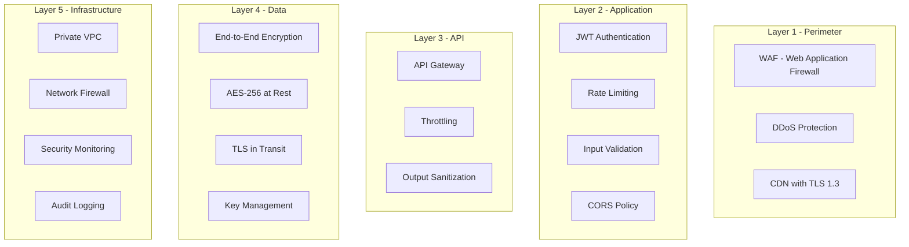

# Security Architecture

## Connecta — Security Design & Compliance

**Version:** 1.0.0
**Date:** July 2026

---

## 1. Security Overview

### 1.1 Security Principles

1. **Defense in Depth** — Multiple layers of security controls
2. **Least Privilege** — Every component accesses only what it needs
3. **Zero Trust** — Never trust, always verify
4. **Privacy by Design** — Security and privacy built into architecture
5. **Secure by Default** — Safest option is the default

### 1.2 Security Layers



---

## 2. Authentication & Authorization

### 2.1 JWT Strategy

```typescript
// Token structure
interface AccessTokenPayload {
  sub: string;        // User ID
  email: string;
  role: 'user' | 'admin';
  permissions: string[];
  mfa_verified: boolean;
  iat: number;
  exp: number;
  jti: string;        // Unique token ID
}
```

### 2.2 Token Security

| Measure | Implementation |
|---|---|
| Short-lived access tokens | 15 minutes |
| Single-use refresh tokens | Rotate on each refresh |
| Token binding | Device ID in token claims |
| Blacklist on logout | Redis blacklist for active tokens |
| No token in URLs | Authorization header only |

### 2.3 Password Security

- **Hashing:** bcrypt with cost factor 12
- **Minimum length:** 8 characters
- **Complexity:** At least one letter and one number
- **Breach check:** Have I Been Pwned API integration

### 2.4 OAuth 2.0 Integration

| Provider | Flow | Scopes |
|---|---|---|
| Google | Authorization Code + PKCE | email, profile |
| Apple | Sign In with Apple | email, name |
| Facebook | Authorization Code | email, public_profile |

---

## 3. Rate Limiting

### 3.1 Rate Limit Rules

| Endpoint Category | Limit | Window | Burst |
|---|---|---|---|
| Auth (login/register) | 5 | 15 min | 3 |
| OTP send | 3 | 5 min | 1 |
| Password reset | 3 | 15 min | 1 |
| API (authenticated) | 120 | 1 min | 20 |
| API (premium) | 300 | 1 min | 50 |
| File upload | 10 | 1 min | 5 |
| Search | 30 | 1 min | 10 |
| Admin API | 600 | 1 min | 100 |
| WebSocket messages | 60 | 1 min | 30 |

### 3.2 Implementation

```typescript
// Rate limiting with Redis
@Injectable()
export class RateLimitGuard implements CanActivate {
  async canActivate(context: ExecutionContext): Promise<boolean> {
    const request = context.switchToHttp().getRequest();
    const key = `rate:${request.user?.id || request.ip}:${request.route.path}`;
    const limit = this.getLimit(request);
    const window = this.getWindow(request);

    const current = await this.redis.incr(key);
    if (current === 1) {
      await this.redis.expire(key, window);
    }

    if (current > limit) {
      throw new HttpException(
        { code: 'RATE_LIMIT_EXCEEDED', message: 'Too many requests' },
        HttpStatus.TOO_MANY_REQUESTS
      );
    }

    return true;
  }
}
```

---

## 4. Input Validation

### 4.1 SQL Injection Protection

- TypeORM parameterized queries (never string concatenation)
- Stored procedures for complex queries
- Input sanitization middleware
- Database user with minimal permissions

### 4.2 XSS Protection

- Output encoding on all API responses
- Content Security Policy headers
- HttpOnly and Secure flags on cookies
- React Native's built-in XSS protection

### 4.3 CSRF Protection

- SameSite cookie attribute
- CSRF token for state-changing operations
- Origin/Referer header validation

---

## 5. Data Protection

### 5.1 Encryption at Rest

| Data Type | Method | Key Management |
|---|---|---|
| Database (PostgreSQL) | AES-256-GCM | AWS KMS / Azure Key Vault |
| Files (S3/R2) | AES-256 | Server-side encryption (SSE-S3) |
| Backups | AES-256 | Separate backup key |
| Logs | AES-256 | Log encryption key |
| Local (SQLite) | SQLCipher (AES-256) | Device keychain |

### 5.2 Encryption in Transit

- TLS 1.3 for all external connections
- mTLS for inter-service communication (optional)
- Certificate pinning on mobile app

### 5.3 PII Handling

| Data Element | Storage | Encryption | Retention |
|---|---|---|---|
| Phone number | PostgreSQL | Field-level AES | Until deletion |
| Email | PostgreSQL | Field-level AES | Until deletion |
| Date of birth | PostgreSQL | Table encryption | Until deletion |
| Location | PostgreSQL | Table encryption | 30 days (precise) |
| Photos | S3/R2 | SSE + E2EE | Until deletion |
| Messages | SQLite + S3 | E2EE only | User-controlled |
| Payment info | Payment gateway | Tokenized | Gateway-managed |

---

## 6. Certificate Pinning

```typescript
// src/security/certificate-pinning.ts
import { RNSSLPinning } from 'react-native-ssl-pinning';

const CERTIFICATE_PINS = {
  'api.connecta.app': ['sha256/AAAAAAAAAAAAAAAAAAAAAAAAAAAAAAAAAAAAAAAAAAA='],
  'cdn.connecta.app': ['sha256/BBBBBBBBBBBBBBBBBBBBBBBBBBBBBBBBBBBBBBBBBBB='],
};

export async function secureFetch(url: string, options: RequestInit): Promise<Response> {
  return RNSSLPinning.fetch(url, {
    ...options,
    sslPinning: {
      certs: CERTIFICATE_PINS[new URL(url).hostname],
    },
    timeoutInterval: 10000,
  });
}
```

---

## 7. OWASP Top 10 Mitigations

| # | Vulnerability | Mitigation |
|---|---|---|
| A01 | Broken Access Control | RBAC, ownership checks, resource-level permissions |
| A02 | Cryptographic Failures | AES-256, TLS 1.3, Signal Protocol E2EE |
| A03 | Injection | Parameterized queries, input validation, TypeORM |
| A04 | Insecure Design | Threat modeling, security architecture review |
| A05 | Security Misconfiguration | Hardened defaults, automated scanning |
| A06 | Vulnerable Components | Dependabot, regular dependency updates |
| A07 | Auth Failures | MFA, rate limiting, account lockout |
| A08 | Data Integrity Failures | Digital signatures, integrity checks |
| A09 | Logging Failures | Structured audit logging, no PII in logs |
| A10 | SSRF | Input validation, allowlist URLs, network segmentation |

---

## 8. NDPA Compliance (Nigerian Data Protection Act)

| Requirement | Implementation |
|---|---|
| Lawful basis for processing | Consent (registration), legitimate interest (matching) |
| Data minimization | Collect only necessary data |
| Purpose limitation | Data used only for stated purposes |
| Data accuracy | User-editable profiles, verification |
| Storage limitation | Configurable retention periods |
| Right to access | Data export feature |
| Right to rectification | Profile editing |
| Right to erasure | Account deletion feature |
| Data breach notification | 72-hour notification to NDPC |
| Data Protection Officer | Designate DPO for Connecta |
| Cross-border transfer | Data residency in Nigeria |

### 8.1 Privacy Policy Requirements

- Clear language explanation of data collection
- Specific purposes for each data type
- Third-party data sharing disclosures
- User rights and how to exercise them
- Contact information for privacy inquiries
- Cookie and tracking disclosures

---

## 9. Security Monitoring

### 9.1 Audit Logging

```typescript
// All admin actions logged
interface AuditLogEntry {
  adminId: string;
  action: string;        // 'user.suspend', 'report.resolve', etc.
  targetType: string;    // 'user', 'report', 'message'
  targetId: string;
  details: Record<string, unknown>;
  ipAddress: string;
  timestamp: Date;
}
```

### 9.2 Security Alerts

| Alert | Condition | Response |
|---|---|---|
| Brute force login | 10+ failed attempts in 5 min | Temporary lockout + alert |
| Token theft | Same token used from 2+ IPs | Invalidate all sessions |
| API abuse | 500+ requests/min from IP | Auto-ban IP |
| Data exfiltration | Large download volumes | Alert + manual review |
| Admin anomaly | Unusual admin access pattern | Alert + 2FA required |

---

## 10. Penetration Testing Schedule

| Frequency | Scope | Provider |
|---|---|---|
| Quarterly | Full API + Web App | External security firm |
| Monthly | Automated vulnerability scan | OWASP ZAP / Burp Suite |
| Weekly | Dependency vulnerability scan | Dependabot / Snyk |
| Per-release | Code review for security | Internal team |

---

## 11. Implementation Status

### V1 (Current) — Implemented

| Feature | Status | Details |
|---|---|---|
| JWT authentication | ✅ Implemented | 15min access + 7d refresh tokens |
| Password hashing (bcrypt) | ✅ Implemented | Cost factor 12, salt rounds |
| Rate limiting | ✅ Implemented | ThrottlerModule on all 12 services via global guard |
| CORS configuration | ✅ Implemented | All 12 services with credentials support |
| E2EE (Signal Protocol) | ✅ Implemented | Curve25519 + AES-256-GCM |
| Certificate pinning | ✅ Implemented | Mobile app via trustkit |
| Secure keychain storage | ✅ Implemented | expo-secure-store |
| Input validation | ⚠️ Partial | Basic pipe on auth; needs ClassValidator across all DTOs |
| Helmet/CSP headers | ⚠️ Partial | Need helmet middleware on API gateway |
| Security logging | ⚠️ Partial | NestJS Logger; no structured JSON audit log yet |
| HIBP breach check | ❌ Not implemented | bcrypt only |
| Token blacklist (Redis) | ❌ Not implemented | Logout invalidates refresh only |
| OAuth 2.0 (Google/Apple) | ❌ Not implemented | Placeholder routes |
| Admin audit log persistence | ❌ Not implemented | In-memory only |
| Data at rest encryption | ❌ Not implemented | DB-level encryption |

### V2 (Planned)

- Token blacklist via Redis
- OAuth 2.0 social login
- HIBP password breach checking
- Structured JSON security audit logging
- Admin audit log persistence

### V3 (Future)

- Hardware security key (WebAuthn)
- Zero-knowledge proof authentication
- Quantum-resistant cryptography assessment
- Formal security verification

---

*This document is part of the Connecta Software Design Document (SDD) package.*
