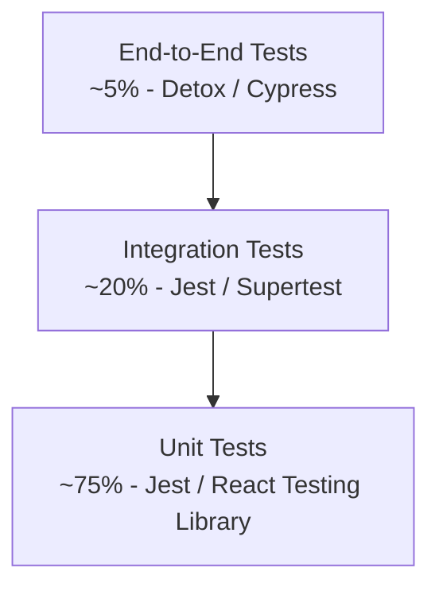

# Testing Strategy

## Connecta — Testing Plan & Quality Assurance

**Version:** 1.0.0
**Date:** July 2026

---

## 1. Testing Philosophy

Connecta follows the **test pyramid** approach: many unit tests at the base, fewer integration tests in the middle, and minimal but critical E2E tests at the top.



---

## 2. Testing Levels

### 2.1 Unit Tests

**Coverage Target:** 80%+ for business logic

| Layer | Framework | What to Test |
|---|---|---|
| Backend services | Jest | Service methods, DTOs, validators |
| Backend utils | Jest | Helper functions, transformers |
| Mobile components | Jest + React Testing Library | Component rendering, interactions |
| Mobile hooks | Jest | Custom hook behavior |
| AI models | pytest | Model predictions, feature engineering |

### 2.2 Integration Tests

**Coverage Target:** All API endpoints

| Scope | Framework | What to Test |
|---|---|---|
| API endpoints | Jest + Supertest | Request/response, status codes, auth |
| Database queries | Jest + TypeORM | Query correctness, migrations |
| WebSocket events | Jest + socket.io-client | Event handling, broadcasting |
| External services | Jest + MSW | Payment, SMS, push notifications |

### 2.3 End-to-End Tests

**Coverage Target:** Critical user flows

| Flow | Tool | Steps |
|---|---|---|
| Registration | Detox | Phone → OTP → Profile → Onboarding |
| Discovery | Detox | Open app → View profiles → Swipe |
| Matching | Detox | Swipe right → Match → Start chat |
| Messaging | Detox | Send message → Receive reply → Read receipt |
| Payment | Detox | Select plan → Pay → Verify subscription |
| Admin | Cypress | Login → Dashboard → User management |

---

## 3. Backend Testing

### 3.1 Unit Test Example

```typescript
// apps/matching-service/src/matching.service.spec.ts
describe('MatchingService', () => {
  let service: MatchingService;
  let repo: Repository<Like>;

  beforeEach(async () => {
    const module = await Test.createTestingModule({
      providers: [
        MatchingService,
        { provide: getRepositoryToken(Like), useValue: mockRepo },
      ],
    }).compile();

    service = module.get(MatchingService);
    repo = module.get(getRepositoryToken(Like));
  });

  describe('like', () => {
    it('should create a match when mutual like exists', async () => {
      repo.findOne.mockResolvedValue({ userId: 'user-b', likedUserId: 'user-a' });

      const result = await service.like('user-a', 'user-b');

      expect(result.isMatch).toBe(true);
      expect(repo.create).toHaveBeenCalled();
    });

    it('should not create a match on first like', async () => {
      repo.findOne.mockResolvedValue(null);

      const result = await service.like('user-a', 'user-b');

      expect(result.isMatch).toBe(false);
    });

    it('should enforce daily like limit', async () => {
      dailyLikesRepo.findOne.mockResolvedValue({ likesGiven: 50 });

      await expect(
        service.like('free-user', 'user-b')
      ).rejects.toThrow('Daily like limit reached');
    });
  });
});
```

### 3.2 API Integration Test

```typescript
// apps/matching-service/test/matching.e2e-spec.ts
describe('Matching (e2e)', () => {
  let app: INestApplication;
  let authToken: string;

  beforeAll(async () => {
    const module = await Test.createTestingModule({
      imports: [AppModule],
    }).compile();

    app = module.createNestApplication();
    await app.init();

    // Get auth token
    const loginRes = await request(app.getHttpServer())
      .post('/auth/login')
      .send({ email: 'test@example.com', password: 'password123' });
    authToken = loginRes.body.data.accessToken;
  });

  describe('POST /match/like', () => {
    it('should like a user', async () => {
      const res = await request(app.getHttpServer())
        .post('/match/like')
        .set('Authorization', `Bearer ${authToken}`)
        .send({ userId: 'target-user-id' });

      expect(res.status).toBe(201);
      expect(res.body.data).toHaveProperty('isMatch');
    });

    it('should return 401 without auth token', async () => {
      const res = await request(app.getHttpServer())
        .post('/match/like')
        .send({ userId: 'target-user-id' });

      expect(res.status).toBe(401);
    });

    it('should return 400 for invalid userId', async () => {
      const res = await request(app.getHttpServer())
        .post('/match/like')
        .set('Authorization', `Bearer ${authToken}`)
        .send({ userId: '' });

      expect(res.status).toBe(400);
    });
  });

  describe('GET /match/feed', () => {
    it('should return paginated feed', async () => {
      const res = await request(app.getHttpServer())
        .get('/match/feed?page=1&limit=20')
        .set('Authorization', `Bearer ${authToken}`);

      expect(res.status).toBe(200);
      expect(res.body.data).toBeInstanceOf(Array);
      expect(res.body.meta).toHaveProperty('total');
    });
  });
});
```

---

## 4. Mobile Testing

### 4.1 Unit Tests (Jest)

```typescript
// src/components/ProfileCard.test.tsx
import { render, fireEvent } from '@testing-library/react-native';
import { ProfileCard } from './ProfileCard';

describe('ProfileCard', () => {
  const mockProfile = {
    id: '1',
    name: 'Amara',
    age: 28,
    bio: 'Love hiking and photography',
    photos: [{ url: 'https://example.com/photo.jpg' }],
    interests: ['hiking', 'photography'],
  };

  it('renders profile info correctly', () => {
    const { getByText } = render(
      <ProfileCard profile={mockProfile} />
    );

    expect(getByText('Amara, 28')).toBeTruthy();
    expect(getByText('Love hiking and photography')).toBeTruthy();
  });

  it('calls onLike when heart button pressed', () => {
    const onLike = jest.fn();
    const { getByTestId } = render(
      <ProfileCard profile={mockProfile} onLike={onLike} />
    );

    fireEvent.press(getByTestId('like-button'));
    expect(onLike).toHaveBeenCalledWith('1');
  });
});
```

### 4.2 E2E Tests (Detox)

```typescript
// e2e/flows/matching.e2e.ts
describe('Matching Flow', () => {
  beforeAll(async () => {
    await device.launchApp();
    await element(by.id('login-email')).typeText('test@example.com');
    await element(by.id('login-password')).typeText('password123');
    await element(by.id('login-button')).tap();
    await expect(element(by.id('discovery-screen'))).toBeVisible();
  });

  it('should swipe right and potentially match', async () => {
    // View profile
    await expect(element(by.id('profile-card'))).toBeVisible();

    // Swipe right (like)
    await element(by.id('like-button')).tap();

    // Check for match screen or next profile
    await waitFor(element(by.id('match-screen')))
      .toBeVisible()
      .withTimeout(5000)
      .catch(() => {
        // No match, should show next profile
        expect(element(by.id('profile-card'))).toBeVisible();
      });
  });

  it('should send message after matching', async () => {
    // Navigate to matches
    await element(by.id('tab-matches')).tap();
    await expect(element(by.id('matches-list'))).toBeVisible();

    // Tap first match
    await element(by.id('match-item-0')).tap();
    await expect(element(by.id('chat-screen'))).toBeVisible();

    // Send message
    await element(by.id('message-input')).typeText('Hello!');
    await element(by.id('send-button')).tap();
    await expect(element(by.text('Hello!'))).toBeVisible();
  });
});
```

---

## 5. AI Model Testing

### 5.1 Model Evaluation

| Model | Metric | Target | Test Method |
|---|---|---|---|
| Compatibility | AUC-ROC | > 0.75 | Cross-validation |
| Fake Detection | Precision | > 0.90 | Manual review set |
| Scam Detection | Recall | > 0.85 | Known scam dataset |
| Toxicity | F1 Score | > 0.80 | Benchmark dataset |
| Photo Verification | Accuracy | > 0.95 | Labeled dataset |

### 5.2 A/B Testing Framework

```python
# ab_testing/experiment.py
class ABTest:
    def __init__(self, experiment_id: str, variants: list[str]):
        self.experiment_id = experiment_id
        self.variants = variants

    def assign_variant(self, user_id: str) -> str:
        """Deterministic assignment using hash."""
        hash_val = hash(f"{self.experiment_id}:{user_id}")
        variant_index = hash_val % len(self.variants)
        return self.variants[variant_index]

    def track_event(self, user_id: str, event: str, value: float = None):
        """Track experiment event for analysis."""
        variant = self.assign_variant(user_id)
        self.analytics.track(
            experiment_id=self.experiment_id,
            variant=variant,
            user_id=user_id,
            event=event,
            value=value,
        )
```

---

## 6. Load Testing

### 6.1 k6 Load Test

```javascript
// load-tests/api-load.js
import http from 'k6/http';
import { check, sleep } from 'k6';

export const options = {
  stages: [
    { duration: '2m', target: 100 },  // Ramp up
    { duration: '5m', target: 500 },  // Stay at 500
    { duration: '2m', target: 1000 }, // Spike to 1000
    { duration: '5m', target: 1000 }, // Stay at 1000
    { duration: '2m', target: 0 },    // Ramp down
  ],
  thresholds: {
    http_req_duration: ['p(95)<200'], // 95% of requests under 200ms
    http_req_failed: ['rate<0.01'],   // Less than 1% error rate
  },
};

export default function () {
  const token = login();

  // Test feed endpoint
  const feedRes = http.get(`${BASE_URL}/match/feed`, {
    headers: { Authorization: `Bearer ${token}` },
  });
  check(feedRes, { 'feed status 200': (r) => r.status === 200 });

  // Test send message
  const msgRes = http.post(
    `${BASE_URL}/chat/conversations/test/messages`,
    JSON.stringify({ content: 'Load test message' }),
    {
      headers: {
        Authorization: `Bearer ${token}`,
        'Content-Type': 'application/json',
      },
    }
  );
  check(msgRes, { 'message status 201': (r) => r.status === 201 });

  sleep(1);
}
```

---

## 7. Test Environment Management

| Environment | Data | Purpose |
|---|---|---|
| Local | Synthetic fixtures | Development |
| CI | Seeded test data | Automated tests |
| Staging | Anonymized production subset | Pre-production validation |

---

## 8. Quality Gates

| Gate | Criteria | Blocks Release? |
|---|---|---|
| Lint | 0 errors, 0 warnings | Yes |
| Type Check | 0 TypeScript errors | Yes |
| Unit Tests | 80%+ coverage, all pass | Yes |
| Integration Tests | All pass | Yes |
| E2E Tests | Critical flows pass | Yes |
| Security Scan | 0 critical vulnerabilities | Yes |
| Load Test | p95 < 200ms, <1% errors | Yes |
| Manual QA | Sign-off on new features | Yes |

---

*This document is part of the Connecta Software Design Document (SDD) package.*
